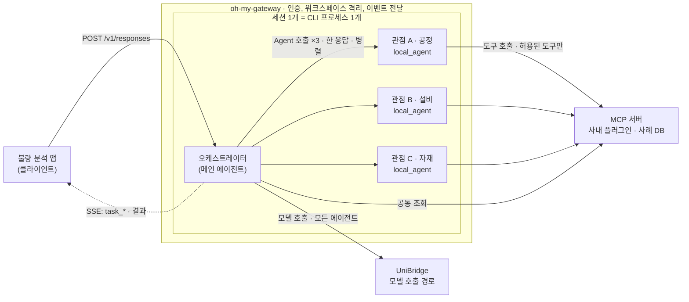
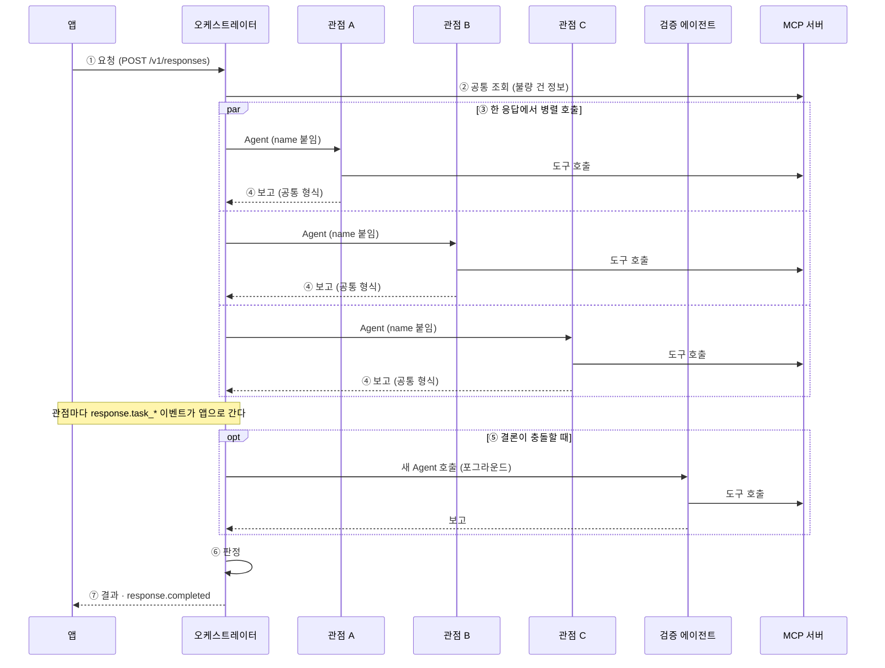
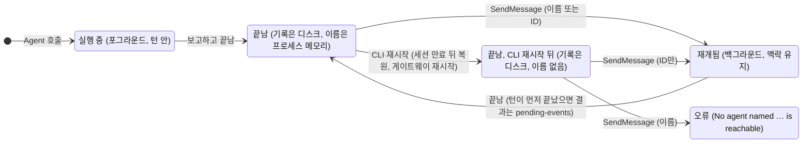
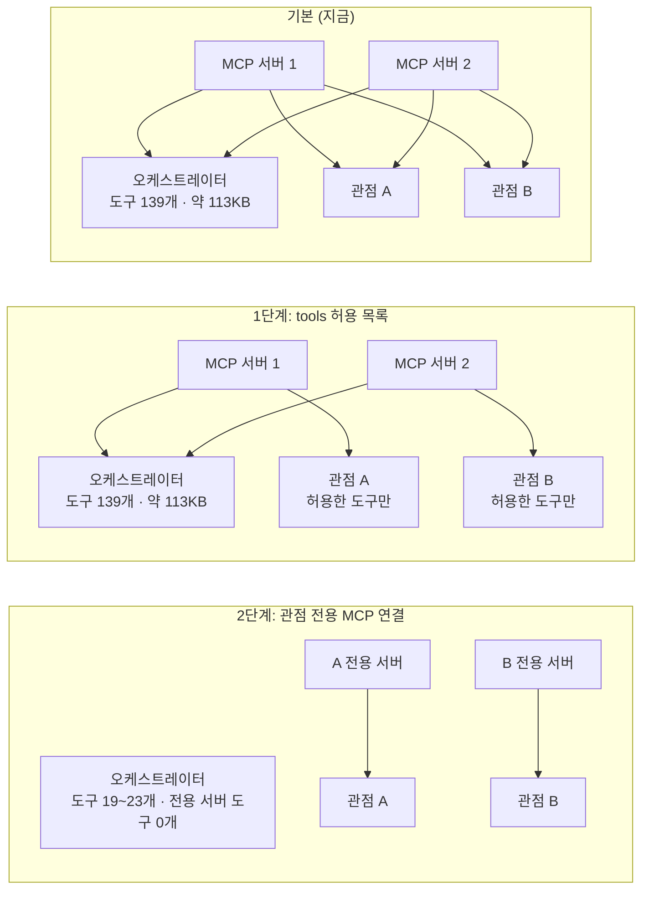

# 불량 분석 에이전트 설계

Date: 2026-10-03
Status: Draft (개정 1, 검토 전)

oh-my-gateway 위에서 오케스트레이터 하나와 관점 에이전트 여러 개로 불량 원인을 분석한다.
이 문서는 구조, 규칙, 근거, 단계별 계획을 정한다.

인터랙티브 버전은 같은 폴더의 [`2026-10-03-defect-analysis-multi-agent-design.html`](2026-10-03-defect-analysis-multi-agent-design.html)이다.
저장소를 받은 뒤 브라우저로 연다. 다이어그램, 근거 상태 필터, 예시 복사 버튼이 있다. 내용은 이 문서와 같다.

| 항목 | 내용 |
|------|------|
| 기준 버전 | oh-my-gateway `main 956a65c` · claude-agent-sdk `0.2.160` · 번들 CLI `2.1.283` |
| 작성 규칙 | ASD-STE100의 원칙을 약 80% 적용한다. 한 문장에 정보 하나를 쓴다. 문장을 짧게 쓴다. 능동형으로 쓴다. §2에서 정의한 용어만 쓴다. 결론을 먼저 쓴다. |
| 근거 표기 | **확인됨**: 실제 CLI로 시험했다 (가짜 모델, 비용 0). 또는 CLI 바이너리나 게이트웨이 코드에서 직접 확인했다. **문서**: 공식 문서나 변경 이력에 있다. **확인 필요**: 아직 시험하지 않았다. **예시**: 설명용 예시다. |
| 주의 문구 | **경고**: 보안 또는 데이터 위험. **주의**: 결과를 잃거나 동작이 깨진다. **참고**: 판단에 도움이 되는 정보. |
| 보안 | 사내 도구(플러그인)의 내용은 이 문서에 넣지 않는다. 이 문서는 구조와 규칙만 다룬다. |

## 1. 결정 요약

이 표가 이 문서의 결론이다. 근거는 오른쪽 열의 절에 있다.

| 항목 | 결정 | 절 |
|------|------|----|
| 하네스 | Claude Code를 쓴다. oh-my-gateway의 Claude 백엔드가 실행한다. 사내 도구가 Claude 플러그인이기 때문이다. | §4 |
| 구조 | 오케스트레이터 1개와 관점 에이전트 N개를 쓴다. 관점 에이전트는 한 턴 안에서 병렬로 실행된다. | §4, §5 |
| 관점 에이전트 정의 | 1단계는 사내 플러그인의 `agents/*.md`에 둔다. 2단계는 게이트웨이 레지스트리로 옮긴다. | §6.2, §8 |
| 도구 범위 | 관점 에이전트마다 자기 도구만 보게 한다. 1단계는 `tools` 허용 목록을 쓴다. 2단계는 관점 전용 MCP 연결을 게이트웨이에 추가한다. | §7, §8 |
| 보고 | 모든 관점 에이전트가 같은 보고 형식을 쓴다. | §6.3 |
| 지식 | 확정된 원인은 사례 DB에 저장한다. 세션 기억에 두지 않는다. | §6.5 |
| A2A, 상주 에이전트 | 1단계와 2단계에서 쓰지 않는다. | §11 |
| CLI 세션 간 메시징 | 쓰지 않는다. 사용자 간 격리가 되지 않는다. | §10 |

## 2. 용어

이 문서는 아래 뜻으로만 용어를 쓴다.

| 용어 | 뜻 |
|------|----|
| 게이트웨이 | oh-my-gateway. Claude Code를 HTTP API로 제공하는 서버. |
| 하네스 | 에이전트 루프를 실행하는 런타임. 이 문서에서는 Claude Code CLI. |
| 세션 | 게이트웨이의 대화 하나. CLI 프로세스 하나가 세션 하나를 실행한다. |
| 턴 | 클라이언트 요청 하나와 그 응답. |
| 오케스트레이터 | 세션의 메인 에이전트. 분석을 나누고 결과를 종합한다. |
| 관점 에이전트 | 관점 하나를 맡는 서브에이전트. |
| 검증 에이전트 | 교차 검증 때 새로 호출하는 포그라운드 서브에이전트. |
| 서브에이전트 | CLI가 같은 프로세스 안에서 실행하는 하위 에이전트. 작업 유형은 `local_agent`이다. |
| 포그라운드 | 턴 안에서 끝나는 실행. 턴은 포그라운드 서브에이전트가 끝날 때까지 기다린다. |
| 백그라운드 | 턴이 끝난 뒤에도 계속되는 실행. 결과는 pending-events로 나간다. |
| pending-events | 턴 사이의 이벤트를 받는 게이트웨이 API. `GET /v1/sessions/{id}/pending-events`. |
| 플러그인 | Claude Code 확장 묶음. 스킬, 에이전트, 커맨드, 훅, MCP 서버를 담는다. |
| MCP 서버 | 도구를 제공하는 프로세스 또는 HTTP 서버. |
| 도구 정의 | 도구의 이름, 설명, 입력 스키마. 모델 호출마다 요청에 실린다. |
| 스킬 | 절차 설명과 스크립트의 묶음. 목록에는 이름과 설명만 실린다. 본문은 쓸 때 읽힌다. |

## 3. 배경과 범위

### 3.1 목표

- 불량 한 건을 여러 관점에서 동시에 분석한다.
- 관점별 근거를 비교해서 원인 후보의 순위를 정한다.
- 판정과 근거를 사람이 검토할 수 있게 보여 준다.

### 3.2 범위 밖

- 상주 에이전트와 A2A 노출. 다시 볼 조건은 §11에 있다.
- CLI 세션 간 메시징. 이유는 §10에 있다.
- 예약 실행. 게이트웨이는 기본 설정(`BLOCKED_DEFERRED_TOOLS`)에서 `ScheduleWakeup`과 `CronCreate`를 막는다.
- 사내 도구의 내용. 보안 때문에 이 문서에 넣지 않는다.

### 3.3 전제

- 사내 도구는 Claude 플러그인으로 이미 구현되어 있다.
- 모든 모델 호출은 UniBridge를 거친다.
- 운영 서버는 워크스페이스 샌드박스를 켠다 (2026-09-27 사용자 확인).

## 4. 전체 구조



**그림 1.** 관점 에이전트는 오케스트레이터와 같은 세션(CLI 프로세스 1개) 안에서 병렬로 실행된다.
관점 에이전트는 끝나면 오케스트레이터에게 보고한다. 별도 서버나 A2A가 필요 없다.

- 앱이 `/v1/responses`로 턴을 보낸다.
- 게이트웨이가 세션의 CLI 프로세스에 턴을 넘긴다.
- 오케스트레이터가 관점 에이전트를 한 응답 안에서 여러 개 호출한다.
- CLI가 그 호출들을 병렬로 실행한다.
- 관점 에이전트는 MCP 서버의 도구로 데이터를 조회한다.
- 모든 에이전트의 모델 호출은 UniBridge를 거친다.
- 게이트웨이는 관점 에이전트마다 `response.task_*` 이벤트를 앱으로 보낸다.

### 4.1 Claude Code를 하네스로 고른 이유

- 사내 도구가 Claude 플러그인이다. MCP 서버는 다른 하네스에서도 그대로 쓸 수 있다. 스킬, 에이전트, 커맨드, 훅은 하네스마다 다시 맞춰야 한다.
- 게이트웨이의 운영 장치를 그대로 쓴다. 워크스페이스 샌드박스, `~/.claude` 보호, MCP 진행 알림 중계, 도구 결과 크기 한도 상향, 프롬프트 버전 관리, UniBridge 사용량 기록이 이미 있다.
- 개발자가 로컬 Claude Code에서 시험한 에이전트 정의가 서버에서 똑같이 동작한다.

> **참고**
> 관점 에이전트는 오케스트레이터와 같은 CLI 프로세스 안에서 실행된다. 관점 수만큼 프로세스가 늘지 않는다.

## 5. 분석 흐름

한 턴은 아래 일곱 단계로 진행된다. 그림 2는 시간 순서를 보여 준다.



**그림 2.** 관점 에이전트 세 개가 같은 시점에 시작한다. 턴은 가장 늦게 끝나는 관점을 기다린다.
교차 검증은 새 포그라운드 호출로 한다.

1. **접수.** 앱이 불량 건 ID를 담아 턴을 보낸다.
2. **맥락 수집.** 오케스트레이터가 공통 도구로 불량 건 정보를 읽는다. 읽는 항목은 lot, 공정 단계, 발생 시점, 불량 유형이다.
3. **병렬 호출.** 오케스트레이터가 고른 관점 에이전트를 한 응답에서 모두 호출한다. 호출마다 `name`을 붙인다.
4. **보고.** 관점 에이전트는 공통 보고 형식(§6.3)으로 보고하고 끝난다. 턴은 가장 늦게 끝나는 관점을 기다린다.
5. **교차 검증.** 관점끼리 결론이 충돌하면 오케스트레이터가 새 포그라운드 Agent 호출로 확인한다. 호출 입력에 확인할 질문과 관련 보고를 넣는다.
6. **판정.** 오케스트레이터가 원인 후보 순위, 근거, 신뢰도, 부족한 데이터를 낸다.
7. **완료.** 게이트웨이가 결과와 `response.completed`를 앱으로 보낸다.

> **주의**
> 관점 에이전트 호출을 여러 응답으로 나누지 않는다. 포그라운드 호출은 끝날 때까지 다음 응답을 막는다.
> 응답을 나누면 관점이 하나씩 순서대로 실행된다.

> **주의**
> 끝난 관점 에이전트에게 SendMessage를 보내지 않는다. 그 에이전트는 백그라운드로 재개된다.
> 턴이 먼저 끝나면 결과는 pending-events로 나간다. 2026-09-27 실제 모델 시험에서 결과는 약 25초 뒤에 도착했다. (확인됨)

> **참고**
> 실행 중인 관점 에이전트끼리는 SendMessage로 메시지를 주고받을 수 있다. 받는 쪽은 다음 도구 호출 때 메시지를 읽는다. (확인됨)

## 6. 구성 요소

### 6.1 오케스트레이터

- 정의 위치: 게이트웨이 프롬프트 라이브러리의 기본 프롬프트. 프롬프트 라이브러리는 버전을 쌓는다. 배포, 되돌리기, 시험 실행을 지원한다.
- 도구: 공통 조회 도구와 Agent 도구만 쓴다. 분석 도구를 직접 쓰지 않는다.
- 판정 형식: §6.3의 보고를 모아 원인 후보 순위를 낸다.

오케스트레이터 프롬프트 (예시):

```text
너는 불량 분석 오케스트레이터다.
너는 직접 분석하지 않는다. 관점 에이전트에게 분석을 나누고 결과를 종합한다.

절차
1. 불량 건 정보를 조회한다: lot, 공정 단계, 발생 시점, 불량 유형.
2. 분석할 관점을 고른다. 고른 이유를 한 문장으로 적는다.
3. 고른 관점 에이전트를 한 응답에서 모두 호출한다. 호출마다 name을 붙인다.
4. 각 보고가 공통 보고 형식을 지키는지 확인한다.
5. 결론이 충돌하면 새 Agent 호출로 확인한다. 끝난 에이전트에게 SendMessage를 보내지 않는다.
6. 판정을 낸다: 원인 후보 순위, 근거, 신뢰도, 부족한 데이터.
```

> **참고**
> 세션은 첫 요청에서 받은 시스템 프롬프트를 계속 쓴다. 기본 프롬프트를 바꾸면 새 세션에만 적용된다.

### 6.2 관점 에이전트

- 정의 위치: 사내 플러그인의 `agents/<관점>.md`.
- 호출 이름: `<플러그인>:<관점>`. 예: `defect-perspectives:equipment`. 접두사 없이 부르면 `Agent type 'equipment' not found.` 오류가 난다. (확인됨)
- `tools`: 이 에이전트가 볼 도구를 정한다. `mcp__<서버>` 또는 `mcp__<서버>__*`로 서버 단위로 허용한다. 생략하면 모든 도구를 상속한다. (문서)
- `skills`: 시작할 때 스킬 본문을 미리 넣는다. 사용할 수 있는 스킬을 제한하지 않는다. 관점의 핵심 스킬만 넣는다. (문서)
- `model`, `maxTurns`: 관점별 비용 상한에 쓴다.
- 플러그인 에이전트는 `hooks`, `mcpServers`, `permissionMode`를 무시한다. (문서, 확인됨)

관점 에이전트 정의 파일 `agents/equipment.md` (예시):

```markdown
---
name: equipment
description: 설비 관점 불량 분석. 설비 센서 추이와 정비 이력으로 원인 후보를 찾는다.
tools: mcp__<설비-서버>, Read
model: <모델 별칭>
maxTurns: 30
---
너는 설비 관점 분석가다.

1. 불량 발생 시점 전후의 설비 데이터를 조회한다.
2. 불량 lot이 지난 설비와 챔버를 확인한다.
3. 정비 이력과 불량 시점을 비교한다.
4. 공통 보고 형식으로 보고한다. 원본 데이터는 파일 경로로 넘긴다.
```

아래 관점은 설명용 예시다. 실제 관점은 사내에서 정한다.

| 관점 | 보는 데이터 | 대표 질문 |
|------|-------------|-----------|
| 공정 | 레시피, 공정 조건 변경 이력 | 불량 시점 전후에 바뀐 조건이 있는가? |
| 설비 | FDC 센서 추이, 정비(PM) 이력 | 특정 설비나 챔버에 불량이 몰리는가? |
| 자재 | 자재 lot, 공급사 변경 | 자재 변경 시점과 불량 시점이 겹치는가? |
| 계측·검사 | 스펙 이탈, 결함 맵 패턴 | 불량 패턴이 알려진 유형과 맞는가? |
| 통계 | 공통성(commonality) 분석, 상관 분석 | 불량 lot들이 공유하는 경로가 있는가? |
| 과거 사례 | 사례 DB의 확정 원인 | 비슷한 사례의 확정 원인은 무엇이었나? |

### 6.3 공통 보고 형식

- 근거마다 출처와 조회 조건을 남긴다.
- 신뢰도는 0과 1 사이의 수로 적는다.
- 반대 증거를 빼지 않는다.
- 조회하지 못한 데이터는 `data_gaps`에 적는다.
- 보고를 짧게 쓴다. 원본 데이터는 파일 경로로 넘긴다.

보고 형식 (예시):

```json
{
  "perspective": "equipment",
  "case_id": "<불량 건 ID>",
  "hypotheses": [
    {
      "cause": "<원인 후보>",
      "confidence": 0.6,
      "evidence": [
        { "source": "<도구 이름>", "query": "<조회 조건>", "finding": "<관찰 결과>" }
      ],
      "counter_evidence": ["<반대 증거>"]
    }
  ],
  "data_gaps": ["<조회하지 못한 데이터와 이유>"],
  "artifacts": ["<원본 데이터 파일 경로>"]
}
```

### 6.4 도구와 데이터

- 도구를 파라미터형으로 묶는다. 예: 센서 그룹마다 도구 하나 대신 `query_fdc(group, lot, step, 기간)` 하나를 둔다. 도구 수를 줄이는 것이 효과가 가장 크다.
- 조회 전용 도구는 MCP 서버에서 `annotations.readOnlyHint: true`를 선언한다. 한 응답의 도구 호출 묶음은 모든 도구가 조회 전용일 때만 동시에 실행된다. (확인됨)
- 게이트웨이의 `readOnlyTools` 설정은 HTTP MCP 서버에만 적용된다. stdio 서버는 서버 쪽에서 선언한다.
- 큰 결과는 파일로 저장하고 요약만 반환한다. 메시지 하나가 게이트웨이 한도를 넘으면 턴 전체가 실패한다. 기본 한도는 16 MiB 설정값이다. 고정된 SDK는 이 값을 바이트가 아니라 문자 수로 센다.
- 오래 걸리는 도구는 진행 알림(`notifications/progress`)을 보낸다. 게이트웨이는 HTTP MCP 서버의 진행 알림을 `response.tool_progress`로 앱에 전달한다.
- 게이트웨이의 MCP 도구 시간 한도는 기본 10분(600000 ms)이다.
- 분석 절차는 스킬로 만든다. 예: 공통성 분석, SPC 판정, 결함 맵 패턴 판정.

> **주의**
> 스킬의 스크립트는 Bash로 실행된다. 관점 에이전트의 `tools`에서 Bash를 빼면 그 관점은 스크립트를 실행할 수 없다.
> 스크립트가 필요한 관점에만 Bash를 허용한다.

### 6.5 지식 (사례 DB)

- 확정된 불량 원인을 사례 DB에 저장한다.
- 관점 에이전트는 MCP 도구로 유사 사례를 조회한다.
- 지식을 세션 기억에 두지 않는다. 이유는 두 가지다.
  - 세션은 마지막 요청 후 60분이 지나면 만료된다 (기본값).
  - CLI가 재시작되면 서브에이전트 이름이 사라진다 (그림 3).



**그림 3.** 끝난 관점 에이전트는 SendMessage로 다시 깨어나지만 백그라운드로 실행된다.
턴이 먼저 끝나면 결과는 pending-events로 나간다. CLI가 재시작되면 이름이 사라지고 ID로만 부를 수 있다.
그래서 주 흐름은 재개에 기대지 않는다. (확인됨)

### 6.6 앱 연동

- 게이트웨이는 관점 에이전트마다 `response.task_started`, `response.task_progress`, `response.task_updated`, `response.task_notification`을 보낸다. `task_type`은 `local_agent`이다.
- SSE의 `response.task_started`에는 `name`이 없다. 이름이 필요하면 Agent `tool_use` 입력의 `name`을 `tool_use_id`로 맞춘다. pending-events의 `active_tasks[].name`에도 이름이 있다.
- 관점 하나만 멈출 때: `POST /v1/sessions/{session_id}/tasks/{task_id}/stop`.
- 요청의 `allowed_tools`로 서브에이전트를 제한한다면 관점 에이전트도 허용 목록에 넣는다. 플러그인 에이전트는 `Agent(<플러그인>:<관점>)`처럼 접두사까지 적는다.
- 이 구조에서 앱이 반드시 받아야 하는 것은 턴의 SSE 스트림이다. pending-events는 교차 검증을 재개 방식으로 바꿀 때만 필요하다.

## 7. 도구 범위

모델 호출마다 그 에이전트가 볼 수 있는 모든 도구 정의가 요청에 실린다. 도구가 많으면 컨텍스트를 차지한다.
도구 선택도 흐려진다. 그래서 관점마다 자기 도구만 보게 한다 (그림 4).



**그림 4.** 화살표는 그 에이전트의 모델 요청에 해당 서버의 도구 정의가 실린다는 뜻이다.
1단계는 관점 에이전트만 가볍게 한다. 2단계는 오케스트레이터에서 관점 전용 MCP 도구 정의를 뺀다.
2단계에서도 공통 조회 서버는 오케스트레이터에 남는다.

| 구성 | 오케스트레이터 요청 | 관점 에이전트 요청 | 근거 |
|------|---------------------|--------------------|------|
| 기본: 모든 MCP 서버를 세션에 연결 | 도구 139개 · 약 113KB | 허용 목록이 없으면 전부 상속 | 확인됨, 문서 |
| 1단계: `tools` 허용 목록 | 139개 · 약 113KB | 허용한 도구만 (3개 → 1.3KB) | 확인됨 |
| 2단계: 관점 전용 MCP 연결 | 19~23개 · 전용 서버 도구 없음 | 전용 서버 도구 + 기본 도구 | 확인됨 |
| 참고: 도구 검색 켬 | 11개 · MCP 도구는 검색 후 로드 | — | 확인됨 |

측정 조건: 모의 MCP 서버(도구 120개), 실제 CLI 2.1.283, 가짜 모델. 크기는 도구 정의 JSON의 바이트 수다. 2026-10-03.

### 7.1 1단계: 코드 변경 없이

1. 사내 플러그인에 관점 에이전트 정의를 추가한다.
2. 각 정의의 `tools`에 그 관점의 서버만 적는다. 예: `tools: mcp__<설비-서버>, Read`.
3. 오케스트레이터 요청의 크기를 잰다. UniBridge 사용량 기록으로 토큰 사용량을 잰다.
4. 오케스트레이터 부담이 크면 2단계로 간다.

> **참고**
> 플러그인 MCP 서버의 도구 이름은 `mcp__<서버 이름>__<도구 이름>`이다. 서버 이름은 플러그인 MCP 설정
> (`plugin.json`의 `mcpServers` 또는 `.mcp.json`)에 선언한 이름이다. 관리자 API `GET /admin/api/plugins/{id}`의
> `mcp_servers`에서도 볼 수 있다. `GET /v1/mcp/servers`는 게이트웨이 설정의 서버만 보여 준다. 플러그인 서버는 나오지 않는다.

### 7.2 2단계: 관점 전용 MCP 연결

게이트웨이에 기능을 추가한다. 설계는 §8에 있다.

> **주의**
> 에이전트 정의 파일의 `mcpServers`로는 2단계를 할 수 없다.
>
> - 플러그인 에이전트는 `mcpServers`를 무시한다. (문서, 확인됨)
> - 게이트웨이는 MCP 서버가 하나라도 있으면 `strict_mcp_config`를 켠다. 이 상태에서는 사용자 범위 에이전트 파일의 `mcpServers`도 적용되지 않는다. (확인됨)
> - 프로젝트 범위 에이전트 파일은 폴더 신뢰가 없으면 `mcpServers`를 건너뛴다. (확인됨)
> - SDK `agents=` 옵션으로 넘긴 정의만 `strict_mcp_config` 상태에서 동작한다. (확인됨)

### 7.3 도구 검색

- `ANTHROPIC_BASE_URL`이 Anthropic 공식 주소가 아니면 도구 검색은 기본으로 꺼진다. UniBridge 경로가 여기에 해당한다. (확인됨)
- `ENABLE_TOOL_SEARCH=true`로 켤 수 있다. 이때 CLI는 `advanced-tool-use-2025-11-20` 베타를 요청에 넣는다. (확인됨)
- 동작하려면 UniBridge가 `tool_reference` 블록과 베타 헤더를 그대로 전달해야 한다. 실제 모델도 이 기능을 지원해야 한다. (확인 필요)
- `auto` 값은 도구 120개에서 켜지지 않았다. (확인됨)
- 판단: 도구 검색은 보조 수단으로만 쓴다.

## 8. 게이트웨이 변경 제안: 관점 전용 MCP 연결

### 8.1 목적

지정한 MCP 서버를 지정한 관점 에이전트에만 연결한다. 오케스트레이터 요청에서 그 서버의 도구 정의를 뺀다.

### 8.2 동작

1. 운영자가 관점 에이전트 레지스트리 파일을 둔다. 설정 이름은 가칭 `GATEWAY_AGENT_REGISTRY`이다.
2. 게이트웨이가 세션을 만들 때 레지스트리를 읽는다.
3. 게이트웨이가 레지스트리의 관점 에이전트를 SDK `options.agents`로 넘긴다.
4. 게이트웨이가 레지스트리에 적힌 MCP 서버를 세션 MCP 맵에서 뺀다. 그 서버 설정을 해당 관점 에이전트 정의 안에 넣는다.
5. 게이트웨이가 옮기는 서버에도 세션 서버와 같은 변환을 적용한다. 변환 항목은 자격 증명 오버레이, `{{env:…}}` 해석, 게이트웨이 전용 키(`readOnlyTools`) 제거, HTTP 서버의 진행 알림 중계 주소 변환이다. 에이전트 전용 서버에서 중계가 동작하는지는 아직 모른다. (확인 필요)
6. 세션 MCP 맵이 비어도 `strict_mcp_config`를 켠다. 지금 코드(`_configure_mcp_servers`)는 맵이 비면 켜지 않는다. 그러면 플러그인 MCP 서버가 세션에 다시 붙고, 오케스트레이터가 그 도구를 다시 본다.

레지스트리 (예시, 가칭):

```json
{
  "agents": {
    "equipment": {
      "description": "설비 관점 불량 분석",
      "prompt_file": "<플러그인 경로>/agents/equipment.md",
      "tools": ["mcp__<설비-서버>", "Read"],
      "mcp_servers": ["<설비-서버>"],
      "model": "<모델 별칭>",
      "maxTurns": 30
    }
  }
}
```

`mcp_servers`에 적은 서버는 세션 MCP 맵에서 빠진다. 그 서버는 이 관점 에이전트에만 연결된다.

### 8.3 호환성

- 레지스트리가 없으면 게이트웨이는 지금과 똑같이 동작한다.
- `options.agents`로 넘긴 에이전트는 접두사 없이 이름 그대로 호출된다. 예: `equipment`. (확인됨)
- 레지스트리로 옮긴 관점은 플러그인 `agents/`에서 뺀다. 플러그인 사본이 남으면 모델이 그 사본(`<플러그인>:<관점>`)을 부를 수 있다. 그 사본에는 서버가 없어서 도구 호출이 실패한다.
- 사본을 뺄 수 없으면 `disallowed_tools`에 `Agent(<플러그인>:<관점>)`을 넣는다. 게이트웨이 훅이 이 호출을 거부한다.

### 8.4 검증 계획

저장소의 기존 핀 테스트 방식(실제 CLI + 가짜 모델)으로 아래 항목을 고정한다.

- 오케스트레이터 요청에 지정 서버의 도구가 없다.
- 관점 에이전트 요청에 지정 서버의 도구가 있다.
- 관점 에이전트가 그 도구를 실제로 호출하고 결과를 받는다.
- 세션 MCP 맵이 비어도 `strict_mcp_config`가 켜진다.
- 옮긴 HTTP 서버의 진행 알림과 조회 전용 표시가 유지된다.
- 남아 있는 플러그인 사본을 부르면 거부된다.
- 레지스트리가 없을 때 기존 동작이 바뀌지 않는다.

### 8.5 확인할 점

- 같은 서버를 쓰는 관점 에이전트가 여럿일 때 서버 프로세스가 몇 개 뜨는가? (확인 필요)
- 관점 에이전트가 끝날 때 서버 프로세스가 정리되는가? (확인 필요)
- CLI를 올릴 때 이 동작이 유지되는가? 핀 테스트가 이것을 감시한다.

## 9. 확인된 동작과 제약

이 설계가 기대는 동작을 모았다. 기준 버전은 문서 머리의 버전이다.

| 동작 | 결과 | 근거 | 상태 |
|------|------|------|------|
| 진짜 에이전트 팀 (상주 팀원) | 불가 | CLI는 대화형 세션에서만 팀을 만든다. SDK는 항상 비대화형으로 CLI를 실행한다. | 확인됨 |
| TeamCreate, TeamDelete 도구 | 없음 | CLI 2.1.178에서 제거됐다. | 문서 |
| 최신 버전의 팀 지원 | 변화 없음 | SDK 0.2.163 (CLI 2.1.286)도 팀 생성 조건이 같다. 바이너리로 확인했다. | 확인됨 |
| 이름 붙은 관점 에이전트 병렬 실행 | 된다 | 게이트웨이 e2e에서 두 에이전트가 같은 시각에 시작하고 함께 끝났다. | 확인됨 |
| 실행 중인 에이전트끼리 메시지 | 된다 | 받는 쪽은 다음 도구 호출 때 읽는다. | 확인됨 |
| 끝난 에이전트 재개 | 된다 (백그라운드) | 이전 맥락을 유지한다. 턴이 먼저 끝나면 결과는 pending-events로 나간다. | 확인됨 |
| CLI 재시작 뒤 이름으로 호출 | 안 된다 | ID로는 된다. 맥락도 유지된다. | 확인됨 |
| 세션 유휴 만료 | 60분 (기본) | 요청마다 연장된다. 만료 뒤 대화 기록에서 복원된다. 게이트웨이 코드로 확인했다. | 확인됨 |
| 플러그인 에이전트의 `mcpServers` | 무시 | 공식 문서와 CLI 경고 문구가 같다. | 문서 |
| 파일 에이전트의 `mcpServers` (strict 켬) | 무시 | 사용자 범위는 strict를 끄면 적용된다. 프로젝트 범위는 폴더 신뢰도 필요하다. | 확인됨 |
| SDK `agents=` 정의의 `mcpServers` | 된다 | `strict_mcp_config`를 켜도 적용된다. | 확인됨 |
| 서브에이전트 `tools` 허용 목록 | 된다 | 허용한 도구만 요청에 실린다. | 확인됨 |
| 도구 검색 (UniBridge 경로) | 기본 꺼짐 | 공식 주소가 아니면 꺼진다는 CLI 메시지가 있다. | 확인됨 |
| CLI 세션 간 메시징의 사용자 간 격리 | 안 된다 | 설정 디렉터리로는 찾기만 막힌다. 소켓 경로로 보내면 전달된다. | 확인됨 |
| Claude Code의 A2A 지원 | 없음 | 공식 문서와 변경 이력에 없다. | 문서 |
| 워크스페이스 샌드박스 훅 (서브에이전트 도구 호출) | 적용됨 | 2026-09-27 게이트웨이 e2e. | 확인됨 |
| UniBridge의 `tool_reference` 전달 | 모름 | 운영 경로에서 시험해야 한다. | 확인 필요 |
| 인라인 MCP 서버의 프로세스 수 | 모름 | 2단계 구현 때 확인한다. | 확인 필요 |

### 9.1 원문 메시지와 문구

- CLI (SDK 방식 실행 조건): `Error: --input-format=stream-json requires --print.`
- 공식 문서 (agent teams): `In non-interactive mode with the -p flag, including Agent SDK sessions, Claude doesn't spawn teammates, and a subagent that Claude names runs as an ordinary subagent even with agent teams enabled.`
- CHANGELOG 2.1.178: `Agent teams: removed the TeamCreate and TeamDelete tools. … every session now has one implicit team — spawn teammates directly with the Agent tool's name parameter`
- 실행 중 메시지: `Message queued for delivery to worker-a at its next tool round.`
- 재개: `Resuming agent worker-a`
- 재시작 뒤 이름 호출: `No agent named 'worker-a' is reachable. Check the spelling, or use the agent ID from a background agent's spawn result.`
- 접두사 없는 플러그인 에이전트: `Agent type 'equipment' not found. Available agents: … defect-perspectives:equipment …`
- CLI (플러그인 에이전트): `Plugin agent file … sets mcpServers, which is ignored for plugin agents. Use .claude/agents/ for this level of control.`
- 공식 문서 (subagents): `For security reasons, plugin subagents don't support the hooks, mcpServers, or permissionMode frontmatter fields.`
- 공식 문서 (skills 필드): `This field controls which skills are preloaded, not which skills the subagent can access`
- CLI (프로젝트 에이전트): `Skipping frontmatter MCP servers for agent '…': the folder its definition file came from is not trusted`
- CLI (도구 검색): `[ToolSearch:optimistic] disabled: ANTHROPIC_BASE_URL=… is not a first-party Anthropic host. Set ENABLE_TOOL_SEARCH=true (or auto / auto:N) if your proxy forwards tool_reference blocks.`

## 10. 보안과 운영

> **경고**
> CLI 세션 간 메시징(`CLAUDE_CODE_HARBOR_KITE`)을 켜지 않는다.
>
> - 게이트웨이의 CLI 프로세스는 모두 같은 사용자 계정으로 실행된다.
> - 설정 디렉터리를 나누면 다른 세션이 목록에서만 숨겨진다.
> - 소켓 경로(`/tmp/cc-socks-<uid>/<pid>.sock`)로 직접 보내면 메시지가 전달된다. Linux에서는 인증이 없다.
> - 그 결과 한 사용자의 에이전트가 다른 사용자의 세션에 턴을 넣을 수 있다. 그 턴은 받는 세션의 워크스페이스와 권한으로 실행된다. (확인됨)
> - 게이트웨이는 시작할 때 이 값을 `0`으로 설치한다. 이 설정을 유지한다.

> **주의**
> Bash는 아직 사용자 간 격리가 되지 않는다 (#218). Bash가 필요 없는 관점 에이전트는 `tools`에서 Bash를 뺀다.

- 워크스페이스 샌드박스 훅은 관점 에이전트의 도구 호출에도 적용된다. (확인됨)
- 자원: 라이브 세션 하나가 CLI 프로세스 하나를 쓴다. 저장소 문서(`.env.example`)의 측정값은 약 400 MB다. 관점 에이전트는 이 프로세스 안에서 실행된다.
- stdio MCP 서버는 세션마다 따로 실행된다. 세션 수에 비례해서 MCP 서버 프로세스가 늘어난다.
- 비용: 관점 에이전트마다 모델 호출이 따로 생긴다. 관점 수에 비례해서 토큰이 늘어난다. 관점별 `model`과 `maxTurns`로 상한을 둔다.
- 운영 설정값을 확인한다: 세션 유휴 만료(`SESSION_MAX_AGE_MINUTES`), 라이브 세션 상한(`MAX_LIVE_SESSIONS`), 설정 출처(`CLAUDE_SETTING_SOURCES`). (확인 필요)

## 11. 대안과 판단 기록

| 대안 | 판단 | 이유 | 다시 볼 조건 |
|------|------|------|--------------|
| A2A로 관점 노출, 상주 에이전트 | 보류 | Claude Code는 A2A를 직접 부르지 못한다. MCP 브리지가 필요하다. 지식을 사례 DB에 두므로 상주가 필요 없다. | 관점을 다른 팀이 따로 운영할 때 |
| CLI의 진짜 에이전트 팀 | 불가 | SDK 방식에서는 팀이 생기지 않는다. | CLI가 SDK 방식의 팀을 지원할 때. [claude-agent-sdk-python#577](https://github.com/anthropics/claude-agent-sdk-python/issues/577)을 추적한다. |
| CLI 세션 간 메시징 | 금지 | 사용자 간 격리가 되지 않는다. | 테넌트별 OS 격리(별도 uid, 컨테이너)가 생길 때 |
| 다른 하네스 (Google ADK, 직접 구현) | 미채택 | 사내 플러그인을 다시 만들어야 한다. | 가볍고 호출이 많은 단순 관점이 생길 때 |
| 도구 검색 | 보조 | UniBridge 경로에서 기본으로 꺼진다. 전달 지원을 모른다. | UniBridge 지원을 확인했을 때 |
| 끝난 에이전트 재개로 교차 검증 | 미채택 | 결과가 턴 밖으로 나간다. | 앱이 pending-events를 화면에 반영할 때 |

### 11.1 A2A를 쓰게 될 때

- 외부 팀의 관점 에이전트를 A2A 서버로 노출한다. 서버 쪽은 `a2a-sdk` 1.2.1(Python, FastAPI 연동)로 만들 수 있다.
- 오케스트레이터는 MCP 브리지 도구로 그 에이전트를 호출한다.
- 내부 관점 에이전트와 외부 A2A 에이전트를 함께 쓴다.
- 외부 에이전트는 게이트웨이 워크스페이스의 파일을 볼 수 없다. 필요한 데이터는 메시지에 담아 보낸다.

## 12. 평가 계획

- 원인이 확정된 과거 불량 건으로 시험 세트를 만든다.
- 아래 지표를 잰다.
  - 정답 원인이 1위인 비율
  - 정답 원인이 3위 안에 든 비율
  - 관점별 근거의 정확도 (사람이 검토한다)
  - 턴 시간
  - 토큰 사용량 (UniBridge 사용량 기록)
- 오케스트레이터 프롬프트나 관점 정의를 바꿀 때마다 시험 세트를 다시 실행한다.
- 지표가 이전 버전보다 낮으면 배포하지 않는다.

## 13. 단계별 계획

| 단계 | 할 일 | 코드 변경 | 완료 기준 |
|------|-------|-----------|-----------|
| 1 | 관점 에이전트 정의를 쓴다. 오케스트레이터 프롬프트를 배포한다. 공통 보고 형식을 적용한다. `tools` 허용 목록을 적용한다. | 없음 (사내 플러그인, 프롬프트 라이브러리) | 시험 세트로 기준 지표를 잰다. 오케스트레이터 요청 크기를 잰다. |
| 2 | 관점 전용 MCP 연결을 추가한다 (§8). | 게이트웨이 PR 1개 | 핀 테스트가 통과한다. 오케스트레이터 요청에서 해당 도구 정의가 빠진다. |
| 3 (선택) | 외부 팀 관점을 A2A로 연결한다. | MCP 브리지, A2A 서버 | 외부 팀의 요구가 생긴다. |

## 14. 열린 질문

1. 관점 목록과 관점별 데이터 소스는 무엇인가?
2. 사내 플러그인의 MCP 서버는 stdio인가, HTTP인가? 조회 전용 표시와 진행 알림 처리가 달라진다.
3. UniBridge가 `tool_reference` 블록과 베타 헤더를 전달하는가?
4. 운영의 세션 유휴 만료와 라이브 세션 상한은 얼마인가?
5. 앱이 pending-events를 화면에 반영하는가?
6. 같은 인라인 MCP 서버를 쓰는 관점 에이전트가 여럿일 때 서버 프로세스는 몇 개인가?
7. `.env.example`에 나오는 a2a-agent는 어떤 역할인가?

## 15. 부록: 검증과 출처

### 15.1 검증 방법

- 실제 번들 CLI(2.1.283)와 가짜 Messages API(`tests/fixtures/fake_anthropic_api.py`)로 시험했다. 실제 모델을 쓰지 않았다. 비용은 0이다.
- 게이트웨이 e2e: uvicorn으로 `src.main:app`을 띄우고 가짜 API를 붙였다.
- 저장소 테스트 62개가 통과했다: `test_cli_task_identity.py`, `test_cli_stop_task.py`, `test_runtime_config.py`, `test_cli_cross_session_messaging.py`. `test_cli_mcp_readonly.py`의 3개도 통과했다 (2026-10-03).
- CLI 바이너리의 문자열로 팀 생성 조건, 도구 검색 조건, 에이전트 MCP 처리 규칙을 확인했다.

### 15.2 출처

- [Claude Code 문서: Agent teams](https://code.claude.com/docs/en/agent-teams)
- [Claude Code 문서: Subagents](https://code.claude.com/docs/en/sub-agents)
- [A2A 명세](https://a2a-protocol.org/latest/specification)
- [a2a-sdk (PyPI)](https://pypi.org/project/a2a-sdk/)
- [claude-agent-sdk-python#577: SDK 방식에서 팀 메시지가 리더에게 전달되지 않음](https://github.com/anthropics/claude-agent-sdk-python/issues/577)
- [claude-code-action#1124: SDK 세션 수명 때문에 에이전트 팀을 쓸 수 없음](https://github.com/anthropics/claude-code-action/issues/1124)

### 15.3 정정 기록

- `skills` 필드는 쓸 스킬을 지정하는 필드가 아니다. 본문을 미리 넣는 필드다. 사용 범위를 제한하지 않는다.
- 플러그인 MCP 서버의 이름은 `GET /v1/mcp/servers`로 확인할 수 없다. 플러그인 MCP 설정(`plugin.json`의 `mcpServers` 또는 `.mcp.json`)이나 `GET /admin/api/plugins/{id}`를 본다.
