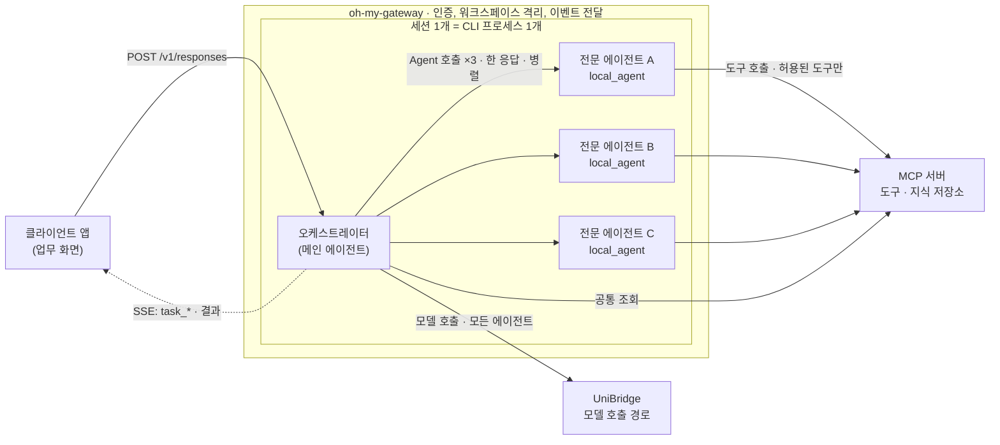
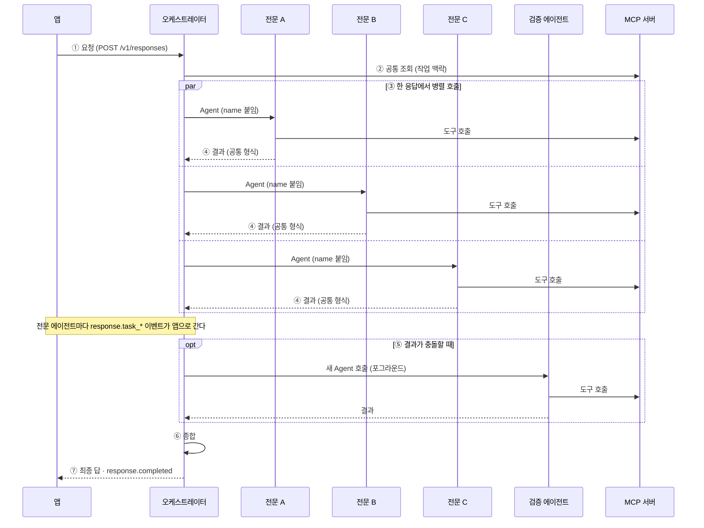
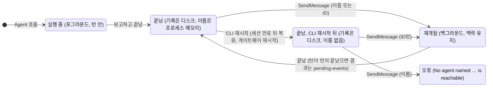
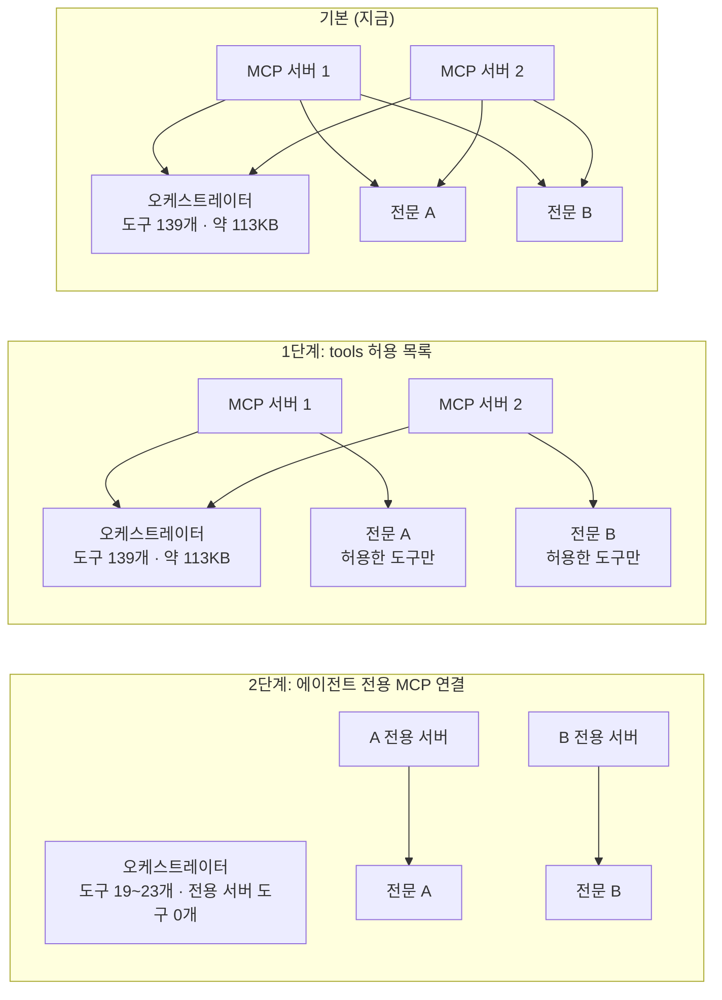
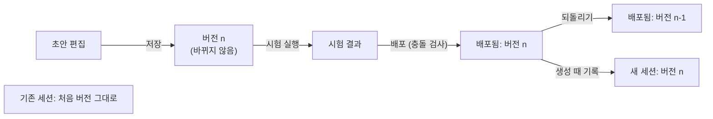

# 멀티에이전트 오케스트레이션 설계

Date: 2026-10-03
Status: Draft (개정 3 · 2026-10-04, 검토 전)

oh-my-gateway 위에서 오케스트레이터 하나와 전문 에이전트 여러 개로 작업을 나눠 처리한다.
이 문서는 특정 업무와 무관한 공통 구조, 규칙, 근거, 단계별 계획을 정한다.

인터랙티브 버전은 같은 폴더의 [`2026-10-03-multi-agent-orchestration-design.html`](2026-10-03-multi-agent-orchestration-design.html)이다.
저장소를 받은 뒤 브라우저로 연다. 다이어그램, 근거 상태 필터, 예시 복사 버튼이 있다. 내용은 이 문서와 같다.

| 항목 | 내용 |
|------|------|
| 개정 | 3 · 2026-10-04. 관리 화면과 시험 채팅을 추가했다. 개정 2에서 불량 분석 전용 내용을 일반화했다. |
| 기준 버전 | oh-my-gateway `main 956a65c` · claude-agent-sdk `0.2.160` · 번들 CLI `2.1.283` |
| 작성 규칙 | ASD-STE100의 원칙을 약 80% 적용한다. 한 문장에 정보 하나를 쓴다. 문장을 짧게 쓴다. 능동형으로 쓴다. §2에서 정의한 용어만 쓴다. 결론을 먼저 쓴다. |
| 근거 표기 | **확인됨**: 실제 CLI로 시험했다 (가짜 모델, 비용 0). 또는 CLI 바이너리나 게이트웨이 코드에서 직접 확인했다. **문서**: 공식 문서나 변경 이력에 있다. **확인 필요**: 아직 시험하지 않았다. **예시**: 설명용 예시다. |
| 주의 문구 | **경고**: 보안 또는 데이터 위험. **주의**: 결과를 잃거나 동작이 깨진다. **참고**: 판단에 도움이 되는 정보. |
| 보안 | 사내 도구(플러그인)의 내용은 이 문서에 넣지 않는다. 이 문서는 구조와 규칙만 다룬다. |

## 1. 결정 요약

이 표가 이 문서의 결론이다. 근거는 오른쪽 열의 절에 있다.

| 항목 | 결정 | 절 |
|------|------|----|
| 하네스 | Claude Code를 쓴다. oh-my-gateway의 Claude 백엔드가 실행한다. 도구를 Claude 플러그인으로 그대로 쓸 수 있기 때문이다. | §4 |
| 구조 | 오케스트레이터 1개와 전문 에이전트 N개를 쓴다. 서로 독립적인 작업은 한 턴 안에서 병렬로 실행한다. | §4, §5 |
| 역할 나누기 | 데이터 소스, 관점, 전문 분야, 작업 단계 중 하나를 기준으로 나눈다. | §6.2 |
| 전문 에이전트 정의 | 1단계는 플러그인의 `agents/*.md`에 둔다. 2단계는 게이트웨이 레지스트리로 옮긴다. | §6.2, §8 |
| 도구 범위 | 전문 에이전트마다 자기 도구만 보게 한다. 1단계는 `tools` 허용 목록을 쓴다. 2단계는 에이전트 전용 MCP 연결을 게이트웨이에 추가한다. | §7, §8 |
| 결과 | 모든 전문 에이전트가 같은 결과 형식을 쓴다. | §6.3 |
| 지식 | 쌓아야 할 지식은 지식 저장소에 둔다. 세션 기억에 두지 않는다. | §6.5 |
| 에이전트 관리 | admin에서 전문 에이전트와 구성을 버전으로 관리한다. 시험한 뒤 배포한다. 프롬프트 라이브러리와 같은 방식이다. | §9 |
| 시험 채팅 | `/admin/chat`을 넓혀 배포 전의 구성이나 에이전트 하나를 대화로 시험한다. | §10 |
| A2A, 상주 에이전트 | 1단계와 2단계에서 쓰지 않는다. | §13 |
| CLI 세션 간 메시징 | 쓰지 않는다. 사용자 간 격리가 되지 않는다. | §12 |

## 2. 용어

이 문서는 아래 뜻으로만 용어를 쓴다.

| 용어 | 뜻 |
|------|----|
| 게이트웨이 | oh-my-gateway. Claude Code를 HTTP API로 제공하는 서버. |
| 하네스 | 에이전트 루프를 실행하는 런타임. 이 문서에서는 Claude Code CLI. |
| 세션 | 게이트웨이의 대화 하나. CLI 프로세스 하나가 세션 하나를 실행한다. |
| 턴 | 클라이언트 요청 하나와 그 응답. |
| 오케스트레이터 | 세션의 메인 에이전트. 작업을 나누고 결과를 종합한다. |
| 전문 에이전트 | 정해진 역할 하나를 맡는 서브에이전트. |
| 검증 에이전트 | 교차 검증 때 새로 호출하는 포그라운드 서브에이전트. |
| 서브에이전트 | CLI가 같은 프로세스 안에서 실행하는 하위 에이전트. 작업 유형은 `local_agent`이다. |
| 포그라운드 | 턴 안에서 끝나는 실행. 턴은 포그라운드 서브에이전트가 끝날 때까지 기다린다. |
| 백그라운드 | 턴이 끝난 뒤에도 계속되는 실행. 결과는 pending-events로 나간다. |
| pending-events | 턴 사이의 이벤트를 받는 게이트웨이 API. `GET /v1/sessions/{id}/pending-events`. |
| 플러그인 | Claude Code 확장 묶음. 스킬, 에이전트, 커맨드, 훅, MCP 서버를 담는다. |
| MCP 서버 | 도구를 제공하는 프로세스 또는 HTTP 서버. |
| 도구 정의 | 도구의 이름, 설명, 입력 스키마. 모델 호출마다 요청에 실린다. |
| 스킬 | 절차 설명과 스크립트의 묶음. 목록에는 이름과 설명만 실린다. 본문은 쓸 때 읽힌다. |
| 지식 저장소 | 에이전트가 MCP 도구로 읽고 쓰는 외부 저장소. 과거 결과와 확정된 결론을 담는다. |
| 에이전트 구성 | 오케스트레이터 프롬프트 버전과 전문 에이전트 버전의 묶음. 배포의 단위다. |
| 에이전트 레지스트리 | 전문 에이전트와 에이전트 구성을 버전과 함께 저장하는 게이트웨이 저장소. |
| 시험 실행 | 배포 전에 후보를 돌려 보는 실행. 임시 워크스페이스를 쓰고 세션을 남기지 않는다. |

## 3. 배경과 범위

### 3.1 목표

- 하나의 요청을 여러 하위 작업으로 나눈다.
- 서로 독립적인 하위 작업을 전문 에이전트가 동시에 처리한다.
- 전문 에이전트의 결과를 비교하고 종합해서 최종 답을 낸다.
- 최종 답과 근거를 사람이 검토할 수 있게 보여 준다.
- 운영자가 화면에서 에이전트를 관리하고, 배포하기 전에 대화로 시험한다.

### 3.2 언제 쓰는가

| 쓴다 | 쓰지 않는다 |
|------|-------------|
| 작업을 서로 독립적인 하위 작업으로 나눌 수 있다. | 작업이 작아서 에이전트 하나로 끝난다. |
| 하위 작업마다 다른 도구나 데이터가 필요하다. | 하위 작업이 앞 결과에 강하게 묶여 있다. |
| 결과를 서로 비교하거나 교차 검증해야 한다. | 토큰 비용 상한이 낮다. 에이전트마다 모델 호출이 따로 생긴다. |

### 3.3 범위 밖

- 상주 에이전트와 A2A 노출. 다시 볼 조건은 §13에 있다.
- CLI 세션 간 메시징. 이유는 §12에 있다.
- 예약 실행. 게이트웨이는 기본 설정(`BLOCKED_DEFERRED_TOOLS`)에서 `ScheduleWakeup`과 `CronCreate`를 막는다.
- 특정 업무의 도구와 데이터. 업무별 적용 예는 §17.1에 있다.

### 3.4 전제

- 도구는 Claude 플러그인으로 제공한다.
- 모든 모델 호출은 UniBridge를 거친다.
- 운영 서버는 워크스페이스 샌드박스를 켠다 (2026-09-27 사용자 확인).

## 4. 전체 구조



**그림 1.** 전문 에이전트는 오케스트레이터와 같은 세션(CLI 프로세스 1개) 안에서 병렬로 실행된다.
전문 에이전트는 끝나면 오케스트레이터에게 결과를 보고한다. 별도 서버나 A2A가 필요 없다.

- 앱이 `/v1/responses`로 턴을 보낸다.
- 게이트웨이가 세션의 CLI 프로세스에 턴을 넘긴다.
- 오케스트레이터가 전문 에이전트를 한 응답 안에서 여러 개 호출한다.
- CLI가 그 호출들을 병렬로 실행한다.
- 전문 에이전트는 MCP 서버의 도구로 데이터를 조회한다.
- 모든 에이전트의 모델 호출은 UniBridge를 거친다.
- 게이트웨이는 전문 에이전트마다 `response.task_*` 이벤트를 앱으로 보낸다.

### 4.1 Claude Code를 하네스로 고른 이유

- 도구를 Claude 플러그인으로 그대로 쓴다. MCP 서버는 다른 하네스에서도 쓸 수 있다. 스킬, 에이전트, 커맨드, 훅은 하네스마다 다시 맞춰야 한다.
- 게이트웨이의 운영 장치를 그대로 쓴다. 워크스페이스 샌드박스, `~/.claude` 보호, MCP 진행 알림 중계, 도구 결과 크기 한도 상향, 프롬프트 버전 관리, UniBridge 사용량 기록이 이미 있다.
- 개발자가 로컬 Claude Code에서 시험한 에이전트 정의가 서버에서 똑같이 동작한다.

> **참고**
> 전문 에이전트는 오케스트레이터와 같은 CLI 프로세스 안에서 실행된다. 에이전트 수만큼 프로세스가 늘지 않는다.

## 5. 실행 흐름

한 턴은 아래 일곱 단계로 진행된다. 그림 2는 시간 순서를 보여 준다.



**그림 2.** 전문 에이전트 세 개가 같은 시점에 시작한다. 턴은 가장 늦게 끝나는 에이전트를 기다린다.
교차 검증은 새 포그라운드 호출로 한다.

1. **접수.** 앱이 요청과 입력 데이터를 담아 턴을 보낸다.
2. **맥락 수집.** 오케스트레이터가 공통 조회 도구로 작업에 필요한 맥락을 읽는다.
3. **병렬 호출.** 오케스트레이터가 고른 전문 에이전트를 한 응답에서 모두 호출한다. 호출마다 `name`을 붙인다.
4. **결과.** 전문 에이전트는 공통 결과 형식(§6.3)으로 보고하고 끝난다. 턴은 가장 늦게 끝나는 에이전트를 기다린다.
5. **교차 검증.** 결과끼리 충돌하면 오케스트레이터가 새 포그라운드 Agent 호출로 확인한다. 호출 입력에 확인할 질문과 관련 결과를 넣는다.
6. **종합.** 오케스트레이터가 최종 답을 낸다. 최종 답에는 결론, 근거, 신뢰도, 부족한 정보가 들어간다.
7. **완료.** 게이트웨이가 최종 답과 `response.completed`를 앱으로 보낸다.

> **주의**
> 병렬로 실행할 호출을 여러 응답으로 나누지 않는다. 포그라운드 호출은 끝날 때까지 다음 응답을 막는다.
> 응답을 나누면 에이전트가 하나씩 순서대로 실행된다.

> **참고**
> 작업 단계를 기준으로 나눈 에이전트는 앞 단계의 결과가 필요하다. 이런 에이전트는 앞 결과를 받은 뒤 순서대로 호출한다.

> **주의**
> 끝난 전문 에이전트에게 SendMessage를 보내지 않는다. 그 에이전트는 백그라운드로 재개된다.
> 턴이 먼저 끝나면 결과는 pending-events로 나간다. 2026-09-27 실제 모델 시험에서 결과는 약 25초 뒤에 도착했다. (확인됨)

> **참고**
> 실행 중인 전문 에이전트끼리는 SendMessage로 메시지를 주고받을 수 있다. 받는 쪽은 다음 도구 호출 때 메시지를 읽는다. (확인됨)

## 6. 구성 요소

### 6.1 오케스트레이터

- 정의 위치: 게이트웨이 프롬프트 라이브러리의 기본 프롬프트. 프롬프트 라이브러리는 버전을 쌓는다. 배포, 되돌리기, 시험 실행을 지원한다.
- 도구: 공통 조회 도구와 Agent 도구만 쓴다. 전문 도구를 직접 쓰지 않는다.
- 최종 답: §6.3의 결과를 모아 결론과 근거를 낸다.

오케스트레이터 프롬프트 (예시):

```text
너는 오케스트레이터다.
너는 직접 작업하지 않는다. 작업을 나눠 전문 에이전트에게 맡기고 결과를 종합한다.

절차
1. 요청과 입력 맥락을 확인한다. 필요하면 공통 조회 도구로 맥락을 읽는다.
2. 맡길 전문 에이전트를 고른다. 고른 이유를 한 문장으로 적는다.
3. 서로 독립적인 작업은 한 응답에서 모두 호출한다. 호출마다 name을 붙인다.
4. 앞 결과가 필요한 작업은 그 결과를 받은 뒤 호출한다.
5. 각 결과가 공통 결과 형식을 지키는지 확인한다.
6. 결과가 충돌하면 새 Agent 호출로 확인한다. 끝난 에이전트에게 SendMessage를 보내지 않는다.
7. 최종 답을 낸다: 결론, 근거, 신뢰도, 부족한 정보.
```

> **참고**
> 세션은 첫 요청에서 받은 시스템 프롬프트를 계속 쓴다. 기본 프롬프트를 바꾸면 새 세션에만 적용된다.

### 6.2 전문 에이전트

- 정의 위치: 플러그인의 `agents/<역할>.md`.
- 호출 이름: `<플러그인>:<역할>`. 접두사 없이 부르면 `Agent type '<역할>' not found.` 오류가 난다. (확인됨)
- `description`: 맡는 일을 한 문장으로 쓴다. 오케스트레이터는 이 설명을 보고 에이전트를 고른다.
- `tools`: 이 에이전트가 볼 도구를 정한다. `mcp__<서버>` 또는 `mcp__<서버>__*`로 서버 단위로 허용한다. 생략하면 모든 도구를 상속한다. (문서)
- `skills`: 시작할 때 스킬 본문을 미리 넣는다. 사용할 수 있는 스킬을 제한하지 않는다. 역할의 핵심 스킬만 넣는다. (문서)
- `model`, `maxTurns`: 에이전트별 비용 상한에 쓴다.
- 플러그인 에이전트는 `hooks`, `mcpServers`, `permissionMode`를 무시한다. (문서, 확인됨)

전문 에이전트 정의 파일 `agents/<역할>.md` (예시):

```markdown
---
name: <역할 이름>
description: <맡는 일을 한 문장으로. 오케스트레이터가 이 설명을 보고 고른다.>
tools: mcp__<서버>, Read
model: <모델 별칭>
maxTurns: 30
---
너는 <역할> 담당 전문 에이전트다.

1. 맡은 범위의 데이터를 조회한다.
2. 조회 결과에서 근거를 찾는다.
3. 반대 증거도 찾는다.
4. 공통 결과 형식으로 보고한다. 원본 데이터는 파일 경로로 넘긴다.
```

역할은 아래 기준 중 하나로 나눈다.

| 기준 | 설명 | 실행 방식 |
|------|------|-----------|
| 데이터 소스 | 에이전트마다 다른 시스템을 조회한다. 도구 범위가 자연스럽게 나뉜다. | 병렬 |
| 관점 | 같은 대상을 다른 기준으로 본다. | 병렬 |
| 전문 분야 | 분야별 지식과 절차(스킬)를 쓴다. | 병렬 |
| 작업 단계 | 수집, 분석, 검증처럼 앞 단계의 결과가 필요하다. | 순서대로 |

- 병렬로 부르는 에이전트끼리는 서로의 결과를 기다리지 않아야 한다.
- 에이전트끼리 도구 범위가 겹치지 않게 나눈다.

### 6.3 공통 결과 형식

- 근거마다 출처와 조회 조건을 남긴다.
- 신뢰도는 0과 1 사이의 수로 적는다.
- 반대 증거를 빼지 않는다.
- 확인하지 못한 것은 `gaps`에 적는다.
- 결과를 짧게 쓴다. 원본 데이터는 파일 경로로 넘긴다.

결과 형식 (예시):

```json
{
  "agent": "<전문 에이전트 이름>",
  "task": "<맡은 작업>",
  "findings": [
    {
      "claim": "<주장 또는 결론>",
      "confidence": 0.6,
      "evidence": [
        { "source": "<도구 이름>", "query": "<조회 조건>", "observation": "<관찰 결과>" }
      ],
      "counter_evidence": ["<반대 증거>"]
    }
  ],
  "gaps": ["<확인하지 못한 것과 이유>"],
  "artifacts": ["<원본 데이터 파일 경로>"]
}
```

### 6.4 도구와 데이터

- 도구를 파라미터형으로 묶는다. 예: 조회 대상마다 도구를 따로 두지 않고 `query(source, filter, 기간)` 하나를 둔다. 도구 수를 줄이는 것이 효과가 가장 크다.
- 조회 전용 도구는 MCP 서버에서 `annotations.readOnlyHint: true`를 선언한다. 한 응답의 도구 호출 묶음은 모든 도구가 조회 전용일 때만 동시에 실행된다. (확인됨)
- 게이트웨이의 `readOnlyTools` 설정은 HTTP MCP 서버에만 적용된다. stdio 서버는 서버 쪽에서 선언한다.
- 큰 결과는 파일로 저장하고 요약만 반환한다. 메시지 하나가 게이트웨이 한도를 넘으면 턴 전체가 실패한다. 기본 한도는 16 MiB 설정값이다. 고정된 SDK는 이 값을 바이트가 아니라 문자 수로 센다.
- 오래 걸리는 도구는 진행 알림(`notifications/progress`)을 보낸다. 게이트웨이는 HTTP MCP 서버의 진행 알림을 `response.tool_progress`로 앱에 전달한다.
- 게이트웨이의 MCP 도구 시간 한도는 기본 10분(600000 ms)이다.
- 반복되는 절차는 스킬로 만든다. 예: 통계 검정, 데이터 정제, 보고서 양식 작성.

> **주의**
> 스킬의 스크립트는 Bash로 실행된다. 전문 에이전트의 `tools`에서 Bash를 빼면 그 에이전트는 스크립트를 실행할 수 없다.
> 스크립트가 필요한 에이전트에만 Bash를 허용한다.

### 6.5 지식 저장소

- 작업 결과와 확정된 결론을 지식 저장소에 저장한다.
- 전문 에이전트는 MCP 도구로 과거 결과를 조회한다.
- 지식을 세션 기억에 두지 않는다. 이유는 두 가지다.
  - 세션은 마지막 요청 후 60분이 지나면 만료된다 (기본값).
  - CLI가 재시작되면 서브에이전트 이름이 사라진다 (그림 3).



**그림 3.** 끝난 전문 에이전트는 SendMessage로 다시 깨어나지만 백그라운드로 실행된다.
턴이 먼저 끝나면 결과는 pending-events로 나간다. CLI가 재시작되면 이름이 사라지고 ID로만 부를 수 있다.
그래서 주 흐름은 재개에 기대지 않는다. (확인됨)

### 6.6 앱 연동

- 게이트웨이는 전문 에이전트마다 `response.task_started`, `response.task_progress`, `response.task_updated`, `response.task_notification`을 보낸다. `task_type`은 `local_agent`이다.
- SSE의 `response.task_started`에는 `name`이 없다. 이름이 필요하면 Agent `tool_use` 입력의 `name`을 `tool_use_id`로 맞춘다. pending-events의 `active_tasks[].name`에도 이름이 있다.
- 에이전트 하나만 멈출 때: `POST /v1/sessions/{session_id}/tasks/{task_id}/stop`.
- 요청의 `allowed_tools`로 서브에이전트를 제한한다면 전문 에이전트도 허용 목록에 넣는다. 플러그인 에이전트는 `Agent(<플러그인>:<역할>)`처럼 접두사까지 적는다.
- 이 구조에서 앱이 반드시 받아야 하는 것은 턴의 SSE 스트림이다. pending-events는 교차 검증을 재개 방식으로 바꿀 때만 필요하다.

## 7. 도구 범위

모델 호출마다 그 에이전트가 볼 수 있는 모든 도구 정의가 요청에 실린다. 도구가 많으면 컨텍스트를 차지한다.
도구 선택도 흐려진다. 그래서 전문 에이전트마다 자기 도구만 보게 한다 (그림 4).



**그림 4.** 화살표는 그 에이전트의 모델 요청에 해당 서버의 도구 정의가 실린다는 뜻이다.
1단계는 전문 에이전트만 가볍게 한다. 2단계는 오케스트레이터에서 전용 MCP 도구 정의를 뺀다.
2단계에서도 공통 조회 서버는 오케스트레이터에 남는다.

| 구성 | 오케스트레이터 요청 | 전문 에이전트 요청 | 근거 |
|------|---------------------|--------------------|------|
| 기본: 모든 MCP 서버를 세션에 연결 | 도구 139개 · 약 113KB | 허용 목록이 없으면 전부 상속 | 확인됨, 문서 |
| 1단계: `tools` 허용 목록 | 139개 · 약 113KB | 허용한 도구만 (3개 → 1.3KB) | 확인됨 |
| 2단계: 에이전트 전용 MCP 연결 | 19~23개 · 전용 서버 도구 없음 | 전용 서버 도구 + 기본 도구 | 확인됨 |
| 참고: 도구 검색 켬 | 11개 · MCP 도구는 검색 후 로드 | — | 확인됨 |

측정 조건: 모의 MCP 서버(도구 120개), 실제 CLI 2.1.283, 가짜 모델. 크기는 도구 정의 JSON의 바이트 수다. 2026-10-03.

### 7.1 1단계: 코드 변경 없이

1. 플러그인에 전문 에이전트 정의를 추가한다.
2. 각 정의의 `tools`에 그 에이전트의 서버만 적는다. 예: `tools: mcp__<서버>, Read`.
3. 오케스트레이터 요청의 크기를 잰다. UniBridge 사용량 기록으로 토큰 사용량을 잰다.
4. 오케스트레이터 부담이 크면 2단계로 간다.

> **참고**
> 플러그인 MCP 서버의 도구 이름은 `mcp__<서버 이름>__<도구 이름>`이다. 서버 이름은 플러그인 MCP 설정
> (`plugin.json`의 `mcpServers` 또는 `.mcp.json`)에 선언한 이름이다. 관리자 API `GET /admin/api/plugins/{id}`의
> `mcp_servers`에서도 볼 수 있다. `GET /v1/mcp/servers`는 게이트웨이 설정의 서버만 보여 준다. 플러그인 서버는 나오지 않는다.

### 7.2 2단계: 에이전트 전용 MCP 연결

게이트웨이에 기능을 추가한다. 설계는 §8에 있다.

> **주의**
> 에이전트 정의 파일의 `mcpServers`로는 2단계를 할 수 없다.
>
> - 플러그인 에이전트는 `mcpServers`를 무시한다. (문서, 확인됨)
> - 게이트웨이는 MCP 서버가 하나라도 있으면 `strict_mcp_config`를 켠다. 이 상태에서는 사용자 범위 에이전트 파일의 `mcpServers`도 적용되지 않는다. (확인됨)
> - 프로젝트 범위 에이전트 파일은 폴더 신뢰가 없으면 `mcpServers`를 건너뛴다. (확인됨)
> - SDK `agents=` 옵션으로 넘긴 정의만 `strict_mcp_config` 상태에서 동작한다. (확인됨)

### 7.3 도구 검색

- `ANTHROPIC_BASE_URL`이 Anthropic 공식 주소가 아니면 도구 검색은 기본으로 꺼진다. UniBridge 경로가 여기에 해당한다. (확인됨)
- `ENABLE_TOOL_SEARCH=true`로 켤 수 있다. 이때 CLI는 `advanced-tool-use-2025-11-20` 베타를 요청에 넣는다. (확인됨)
- 동작하려면 UniBridge가 `tool_reference` 블록과 베타 헤더를 그대로 전달해야 한다. 실제 모델도 이 기능을 지원해야 한다. (확인 필요)
- `auto` 값은 도구 120개에서 켜지지 않았다. (확인됨)
- 판단: 도구 검색은 보조 수단으로만 쓴다.

## 8. 게이트웨이 변경 제안: 에이전트 전용 MCP 연결

### 8.1 목적

지정한 MCP 서버를 지정한 전문 에이전트에만 연결한다. 오케스트레이터 요청에서 그 서버의 도구 정의를 뺀다.

### 8.2 동작

1. 운영자가 전문 에이전트 레지스트리 파일을 둔다. 설정 이름은 가칭 `GATEWAY_AGENT_REGISTRY`이다.
2. 게이트웨이가 세션을 만들 때 레지스트리를 읽는다.
3. 게이트웨이가 레지스트리의 전문 에이전트를 SDK `options.agents`로 넘긴다.
4. 게이트웨이가 레지스트리에 적힌 MCP 서버를 세션 MCP 맵에서 뺀다. 그 서버 설정을 해당 전문 에이전트 정의 안에 넣는다.
5. 게이트웨이가 옮기는 서버에도 세션 서버와 같은 변환을 적용한다. 변환 항목은 자격 증명 오버레이, `{{env:…}}` 해석, 게이트웨이 전용 키(`readOnlyTools`) 제거, HTTP 서버의 진행 알림 중계 주소 변환이다. 에이전트 전용 서버에서 중계가 동작하는지는 아직 모른다. (확인 필요)
6. 세션 MCP 맵이 비어도 `strict_mcp_config`를 켠다. 지금 코드(`_configure_mcp_servers`)는 맵이 비면 켜지 않는다. 그러면 플러그인 MCP 서버가 세션에 다시 붙고, 오케스트레이터가 그 도구를 다시 본다.

레지스트리 (예시, 가칭):

```json
{
  "agents": {
    "<역할 이름>": {
      "description": "<맡는 일을 한 문장으로>",
      "prompt_file": "<플러그인 경로>/agents/<역할>.md",
      "tools": ["mcp__<서버>", "Read"],
      "mcp_servers": ["<서버>"],
      "model": "<모델 별칭>",
      "maxTurns": 30
    }
  }
}
```

`mcp_servers`에 적은 서버는 세션 MCP 맵에서 빠진다. 그 서버는 이 전문 에이전트에만 연결된다.

### 8.3 호환성

- 레지스트리가 없으면 게이트웨이는 지금과 똑같이 동작한다.
- `options.agents`로 넘긴 에이전트는 접두사 없이 이름 그대로 호출된다. (확인됨)
- 레지스트리로 옮긴 에이전트는 플러그인 `agents/`에서 뺀다. 플러그인 사본이 남으면 모델이 그 사본(`<플러그인>:<역할>`)을 부를 수 있다. 그 사본에는 서버가 없어서 도구 호출이 실패한다.
- 사본을 뺄 수 없으면 `disallowed_tools`에 `Agent(<플러그인>:<역할>)`을 넣는다. 게이트웨이 훅이 이 호출을 거부한다.

### 8.4 검증 계획

저장소의 기존 핀 테스트 방식(실제 CLI + 가짜 모델)으로 아래 항목을 고정한다.

- 오케스트레이터 요청에 지정 서버의 도구가 없다.
- 전문 에이전트 요청에 지정 서버의 도구가 있다.
- 전문 에이전트가 그 도구를 실제로 호출하고 결과를 받는다.
- 세션 MCP 맵이 비어도 `strict_mcp_config`가 켜진다.
- 옮긴 HTTP 서버의 진행 알림과 조회 전용 표시가 유지된다.
- 남아 있는 플러그인 사본을 부르면 거부된다.
- 레지스트리가 없을 때 기존 동작이 바뀌지 않는다.

### 8.5 확인할 점

- 같은 서버를 쓰는 전문 에이전트가 여럿일 때 서버 프로세스가 몇 개 뜨는가? (확인 필요)
- 전문 에이전트가 끝날 때 서버 프로세스가 정리되는가? (확인 필요)
- CLI를 올릴 때 이 동작이 유지되는가? 핀 테스트가 이것을 감시한다.

## 9. 관리 화면: 에이전트 관리

### 9.1 목적

- 운영자가 화면에서 전문 에이전트와 에이전트 구성을 만들고 고친다.
- 바꾼 내용은 시험(§10)한 뒤 배포한다. 배포하기 전에는 새 세션이 바뀐 내용을 쓰지 않는다.
- 누가, 언제, 무엇을 바꾸고 배포했는지 남긴다.

### 9.2 관리 대상

| 대상 | 내용 | 규칙 |
|------|------|------|
| 전문 에이전트 | 이름, 설명, 프롬프트, `tools`, 전용 MCP 서버, 모델, `maxTurns`, 미리 넣을 스킬 | §8 레지스트리의 항목 하나다. |
| 에이전트 구성 | 오케스트레이터 프롬프트 버전과 전문 에이전트 버전의 묶음 | 배포의 단위다. 구성마다 이름을 붙인다. |
| 버전 | 저장할 때마다 새 번호를 붙인다. 작성자와 변경 메모를 남긴다. | 지난 버전은 바꾸지 않는다. 프롬프트 라이브러리와 같은 규칙이다. |
| 배포 기록 | 배포와 되돌리기의 시각, 작업자, 대상 버전 | 기록은 덧붙이기만 한다. |

- 저장 위치는 게이트웨이 데이터 디렉터리다. 예: `data/agents/<이름>.json`, `data/agent_sets/<이름>.json`, `data/agent_deployments.jsonl` (가칭). 프롬프트 라이브러리는 같은 방식으로 `data/prompts/<이름>.json`과 `data/prompt_deployments.jsonl`을 쓴다.
- §8의 레지스트리 파일은 처음 값을 넣는 데에만 쓴다. 그 뒤의 변경은 관리 화면이 저장한다.
- 세션은 만들어질 때의 구성 버전을 기록하고 끝까지 쓴다. 기본 프롬프트의 `base_prompt_ref`와 같은 방식이다. 그래서 배포는 새 세션에만 적용된다.
- 구성이 여럿이면 요청이 구성 이름을 고른다 (가칭 `agent_set` 필드). 고르지 않으면 기본 구성을 쓴다.



**그림 5.** 정의는 저장할 때마다 새 버전이 된다. 시험한 버전만 배포한다. 배포는 새 세션에만 적용된다.
기존 세션은 처음 기록한 버전을 계속 쓴다.

### 9.3 화면

게이트웨이 admin에 **Agents** 탭을 추가한다. 지금 플러그인 탭은 플러그인의 에이전트를 보여 주기만 한다. (확인됨)

- 목록: 구성과 전문 에이전트, 배포된 버전, 켜짐 여부, 마지막 작업자를 보여 준다.
- 편집: 필드마다 입력 칸을 둔다. 프롬프트는 편집기로 고친다.
- 도구 고르기: MCP 서버 목록과 도구 목록에서 고른다. 이름을 손으로 치지 않는다.
- 가져오기: 플러그인의 `agents/*.md`를 가져와 첫 버전으로 만든다.
- 버전 비교: 두 버전의 차이를 줄 단위로 보여 준다.
- 저장 검사: 이름 형식, 없는 도구나 서버, 플러그인 사본과의 이름 충돌(§8.3)을 저장할 때 막는다.
- 시험: 편집 화면에서 시험 채팅(§10)을 바로 연다.
- 배포와 되돌리기: 확인 단계를 둔다. 다른 사람이 먼저 배포했으면 409로 거부한다 (`expected_revision`).

### 9.4 API (가칭)

프롬프트 라이브러리 API(`/admin/api/prompt-library`)와 같은 모양으로 만든다.

| 메서드 | 경로 | 하는 일 |
|--------|------|---------|
| GET | `/admin/api/agent-registry` | 구성, 전문 에이전트, 배포 상태를 돌려준다. |
| POST | `/admin/api/agent-registry/agents` | 전문 에이전트를 만든다. |
| GET | `/admin/api/agent-registry/agents/{name}` | 버전 목록과 내용을 돌려준다. |
| POST | `/admin/api/agent-registry/agents/{name}/versions` | 새 버전을 저장한다. `base_version`이 다르면 409. |
| POST | `/admin/api/agent-registry/sets` | 구성을 만들거나 새 버전을 저장한다. |
| POST | `/admin/api/agent-registry/sets/{name}/deploy` | 구성을 배포한다. `expected_revision`이 다르면 409. |
| POST | `/admin/api/agent-registry/import-plugin` | 플러그인 에이전트를 가져온다. |
| POST | `/admin/api/agent-registry/try` | 시험 실행 (§10.3). |
| GET | `/admin/api/agent-registry/deployments` | 배포 기록을 돌려준다. |

- 모든 경로는 admin 인증(`require_admin`)을 거친다.
- 작업자는 `X-Admin-Actor` 헤더로 기록한다. 외부 관리 화면이 운영자 이름을 넘긴다. 헤더가 없으면 `gateway-admin`으로 기록한다.
- 외부 관리 화면(예: 프롬프트 라이브러리를 쓰는 ChatDRAGON BFF)도 같은 API를 쓴다.

### 9.5 사용량과 평가 화면

- 에이전트별 사용량: CLI는 작업마다 `total_tokens`, `tool_uses`, `duration_ms`를 보고한다. 게이트웨이는 이 값을 pending-events의 `active_tasks`에 싣는다.
- 지금 사용량 기록(`usage_turn`, `usage_tool`)에는 에이전트 구분이 없다. (확인됨)
- 작업 단위 기록을 추가한다. 가칭 `usage_task`이고, 응답 ID, 에이전트 이름, 토큰, 도구 호출 수, 시간을 담는다. admin 사용량 탭에 에이전트별 보기를 넣는다.
- 평가 실행: 시험 세트(§14)와 구성 버전을 골라 돌린다. 지표를 버전별로 나란히 보여 준다. 배포 화면에 마지막 평가 결과를 보여 준다.

### 9.6 권한과 기록

- 지금 admin 인증은 `ADMIN_API_KEY` 하나다. 역할 구분이 없다. (확인됨)
- 1차에서는 이 방식을 유지한다. 모든 저장과 배포에 작업자를 기록한다.
- 보기, 편집, 배포의 역할 구분이 필요하면 외부 관리 화면에서 나눈다.

## 10. 시험 채팅

### 10.1 목적

- 운영자가 배포하기 전에 구성을 대화로 시험한다.
- 전문 에이전트 하나만 따로 시험한다.
- 두 버전의 결과를 나란히 비교한다.

### 10.2 화면

기존 `/admin/chat`을 넓힌다. 지금 `/admin/chat`은 모델 선택, 여러 턴 대화, 도구 호출과 `task_*` 카드 표시, 멈춤을 지원한다. (확인됨)

```text
+- 시험 대상 -----------+- 대화 (지금 /admin/chat) --------+- 에이전트 패널 ------------+
| 구성: <이름>          | 사용자: ...                       | 전문 A   실행 중  [멈춤]    |
| 버전: 배포됨 / 초안 3 | 오케스트레이터: ...               |   도구 4회 · 토큰 · 시간   |
| 대상: 구성 전체       |   > 도구 호출 (펼치기)            | 전문 B   끝남               |
|       또는 에이전트 1 |   > Agent 호출 x3                 |   결과 표 (공통 형식)       |
| 모델: <모델>          |                                   +- 턴 사이 결과 -------------+
| [비교 모드]           | [입력]                  [보내기]  | pending-events로 받은 결과  |
+-----------------------+-----------------------------------+-----------------------------+
```

**그림 6.** 시험 채팅 화면. 왼쪽에서 시험 대상을 고른다. 가운데는 지금의 대화 화면이다.
오른쪽은 전문 에이전트마다 상태와 결과를 보여 준다.

- 왼쪽 (시험 대상): 구성과 버전을 고른다. 버전은 배포된 버전이나 초안 버전이다. 구성 전체 또는 전문 에이전트 하나를 고른다. 모델을 고른다. 비교 모드를 켠다.
- 가운데 (대화): 지금 `/admin/chat` 화면을 그대로 쓴다.
- 오른쪽 (에이전트 패널): 전문 에이전트마다 카드를 둔다. 카드는 상태, 진행 설명, 도구 호출 수, 토큰, 시간, 결과를 보여 준다. 결과는 공통 결과 형식(§6.3)을 표로 보여 준다. 카드마다 멈춤 버튼을 둔다 (`POST /v1/sessions/{session_id}/tasks/{task_id}/stop`).
- 오른쪽 아래 (턴 사이 결과): pending-events를 받아 늦게 온 결과를 보여 준다. 지금 `/admin/chat`은 pending-events를 받지 않는다. (확인됨)

### 10.3 동작

1. **배포된 구성 시험.** 일반 `/v1/responses`에 구성 이름(가칭 `agent_set`)을 넣어 보낸다. 실제 세션과 같은 경로이므로 결과도 같다.
2. **초안 시험.** `POST /admin/api/agent-registry/try`를 쓴다.
   - 프롬프트 라이브러리의 시험 실행과 같은 격리를 쓴다. 임시 워크스페이스에서 실행하고 세션을 남기지 않는다.
   - 여러 턴 대화는 앞선 대화를 요청에 함께 보낸다.
   - 출력은 `/v1/responses` 스트림 이벤트와 같은 형식으로 낸다. 그래야 대화 화면이 지금 렌더러를 그대로 쓴다.
3. **에이전트 하나 시험.** 시험 실행에 에이전트 이름을 넣는다. 게이트웨이는 그 에이전트의 프롬프트, 도구, 전용 MCP 서버로 한 턴을 실행한다. 오케스트레이터는 거치지 않는다.
4. **비교.** 같은 입력을 두 대상에 보낸다. 예: 배포된 버전과 초안. 결과를 나란히 보여 준다. 프롬프트 라이브러리의 시험 실행도 같은 비교를 지원한다. `content`를 비우면 배포된 프롬프트로 실행한다. (확인됨)
5. **저장.** 시험 대화와 기대 답을 시험 세트(§14)의 항목으로 저장할 수 있다.

> **주의**
> 시험 실행도 실제 모델을 부르고 실제 도구를 실행한다. 비용이 든다. 쓰기 도구가 있으면 실제 시스템이 바뀐다.
> 시험에서는 쓰기 도구를 `disallowed_tools`로 막거나 시험용 MCP 서버를 쓴다.
> 시험 사용량은 따로 표시한다 (예: `user` 값 `admin-try`).

> **참고**
> 지금 프롬프트 라이브러리의 시험 실행은 한 턴만 실행하고 Claude 모델만 지원한다. 입력 메시지는 8,000자까지다. (확인됨)

## 11. 확인된 동작과 제약

이 설계가 기대는 동작을 모았다. 기준 버전은 문서 머리의 버전이다.

| 동작 | 결과 | 근거 | 상태 |
|------|------|------|------|
| 진짜 에이전트 팀 (상주 팀원) | 불가 | CLI는 대화형 세션에서만 팀을 만든다. SDK는 항상 비대화형으로 CLI를 실행한다. | 확인됨 |
| TeamCreate, TeamDelete 도구 | 없음 | CLI 2.1.178에서 제거됐다. | 문서 |
| 최신 버전의 팀 지원 | 변화 없음 | SDK 0.2.163 (CLI 2.1.286)도 팀 생성 조건이 같다. 바이너리로 확인했다. | 확인됨 |
| 이름 붙은 전문 에이전트 병렬 실행 | 된다 | 게이트웨이 e2e에서 두 에이전트가 같은 시각에 시작하고 함께 끝났다. | 확인됨 |
| 실행 중인 에이전트끼리 메시지 | 된다 | 받는 쪽은 다음 도구 호출 때 읽는다. | 확인됨 |
| 끝난 에이전트 재개 | 된다 (백그라운드) | 이전 맥락을 유지한다. 턴이 먼저 끝나면 결과는 pending-events로 나간다. | 확인됨 |
| CLI 재시작 뒤 이름으로 호출 | 안 된다 | ID로는 된다. 맥락도 유지된다. | 확인됨 |
| 세션 유휴 만료 | 60분 (기본) | 요청마다 연장된다. 만료 뒤 대화 기록에서 복원된다. 게이트웨이 코드로 확인했다. | 확인됨 |
| 플러그인 에이전트의 `mcpServers` | 무시 | 공식 문서와 CLI 경고 문구가 같다. | 문서 |
| 파일 에이전트의 `mcpServers` (strict 켬) | 무시 | 사용자 범위는 strict를 끄면 적용된다. 프로젝트 범위는 폴더 신뢰도 필요하다. | 확인됨 |
| SDK `agents=` 정의의 `mcpServers` | 된다 | `strict_mcp_config`를 켜도 적용된다. | 확인됨 |
| 서브에이전트 `tools` 허용 목록 | 된다 | 허용한 도구만 요청에 실린다. | 확인됨 |
| 도구 검색 (UniBridge 경로) | 기본 꺼짐 | 공식 주소가 아니면 꺼진다는 CLI 메시지가 있다. | 확인됨 |
| CLI 세션 간 메시징의 사용자 간 격리 | 안 된다 | 설정 디렉터리로는 찾기만 막힌다. 소켓 경로로 보내면 전달된다. | 확인됨 |
| Claude Code의 A2A 지원 | 없음 | 공식 문서와 변경 이력에 없다. | 문서 |
| 워크스페이스 샌드박스 훅 (서브에이전트 도구 호출) | 적용됨 | 2026-09-27 게이트웨이 e2e. | 확인됨 |
| admin 인증 | 키 하나 (역할 없음) | `ADMIN_API_KEY` 하나와 세션 쿠키로 인증한다. 작업자는 `X-Admin-Actor` 헤더로 기록한다. | 확인됨 |
| 프롬프트 라이브러리 시험 실행 | 한 턴, Claude 모델만 | 임시 워크스페이스에서 실행한다. 입력은 8,000자까지다. | 확인됨 |
| UniBridge의 `tool_reference` 전달 | 모름 | 운영 경로에서 시험해야 한다. | 확인 필요 |
| 인라인 MCP 서버의 프로세스 수 | 모름 | 2단계 구현 때 확인한다. | 확인 필요 |

### 11.1 원문 메시지와 문구

- CLI (SDK 방식 실행 조건): `Error: --input-format=stream-json requires --print.`
- 공식 문서 (agent teams): `In non-interactive mode with the -p flag, including Agent SDK sessions, Claude doesn't spawn teammates, and a subagent that Claude names runs as an ordinary subagent even with agent teams enabled.`
- CHANGELOG 2.1.178: `Agent teams: removed the TeamCreate and TeamDelete tools. … every session now has one implicit team — spawn teammates directly with the Agent tool's name parameter`
- 실행 중 메시지 (시험에서 쓴 이름): `Message queued for delivery to worker-a at its next tool round.`
- 재개: `Resuming agent worker-a`
- 재시작 뒤 이름 호출: `No agent named 'worker-a' is reachable. Check the spelling, or use the agent ID from a background agent's spawn result.`
- 접두사 없는 플러그인 에이전트 (형식): `Agent type '<역할>' not found. Available agents: … <플러그인>:<역할> …`
- CLI (플러그인 에이전트): `Plugin agent file … sets mcpServers, which is ignored for plugin agents. Use .claude/agents/ for this level of control.`
- 공식 문서 (subagents): `For security reasons, plugin subagents don't support the hooks, mcpServers, or permissionMode frontmatter fields.`
- 공식 문서 (skills 필드): `This field controls which skills are preloaded, not which skills the subagent can access`
- CLI (프로젝트 에이전트): `Skipping frontmatter MCP servers for agent '…': the folder its definition file came from is not trusted`
- CLI (도구 검색): `[ToolSearch:optimistic] disabled: ANTHROPIC_BASE_URL=… is not a first-party Anthropic host. Set ENABLE_TOOL_SEARCH=true (or auto / auto:N) if your proxy forwards tool_reference blocks.`

## 12. 보안과 운영

> **경고**
> CLI 세션 간 메시징(`CLAUDE_CODE_HARBOR_KITE`)을 켜지 않는다.
>
> - 게이트웨이의 CLI 프로세스는 모두 같은 사용자 계정으로 실행된다.
> - 설정 디렉터리를 나누면 다른 세션이 목록에서만 숨겨진다.
> - 소켓 경로(`/tmp/cc-socks-<uid>/<pid>.sock`)로 직접 보내면 메시지가 전달된다. Linux에서는 인증이 없다.
> - 그 결과 한 사용자의 에이전트가 다른 사용자의 세션에 턴을 넣을 수 있다. 그 턴은 받는 세션의 워크스페이스와 권한으로 실행된다. (확인됨)
> - 게이트웨이는 시작할 때 이 값을 `0`으로 설치한다. 이 설정을 유지한다.

> **주의**
> Bash는 아직 사용자 간 격리가 되지 않는다 (#218). Bash가 필요 없는 전문 에이전트는 `tools`에서 Bash를 뺀다.

- 워크스페이스 샌드박스 훅은 전문 에이전트의 도구 호출에도 적용된다. (확인됨)
- 자원: 라이브 세션 하나가 CLI 프로세스 하나를 쓴다. 저장소 문서(`.env.example`)의 측정값은 약 400 MB다. 전문 에이전트는 이 프로세스 안에서 실행된다.
- stdio MCP 서버는 세션마다 따로 실행된다. 세션 수에 비례해서 MCP 서버 프로세스가 늘어난다.
- 비용: 전문 에이전트마다 모델 호출이 따로 생긴다. 에이전트 수에 비례해서 토큰이 늘어난다. 에이전트별 `model`과 `maxTurns`로 상한을 둔다.
- 관리 API(`/admin/api/agent-registry`)는 admin 인증을 거친다. 배포는 모든 새 세션에 영향을 준다. 그래서 작업자와 배포 기록을 남긴다.
- 시험 실행은 실제 도구를 실행한다. 쓰기 도구는 시험에서 막는다 (§10.3).
- 운영 설정값을 확인한다: 세션 유휴 만료(`SESSION_MAX_AGE_MINUTES`), 라이브 세션 상한(`MAX_LIVE_SESSIONS`), 설정 출처(`CLAUDE_SETTING_SOURCES`). (확인 필요)

## 13. 대안과 판단 기록

| 대안 | 판단 | 이유 | 다시 볼 조건 |
|------|------|------|--------------|
| A2A로 에이전트 노출, 상주 에이전트 | 보류 | Claude Code는 A2A를 직접 부르지 못한다. MCP 브리지가 필요하다. 지식을 지식 저장소에 두므로 상주가 필요 없다. | 전문 에이전트를 다른 팀이 따로 운영할 때 |
| CLI의 진짜 에이전트 팀 | 불가 | SDK 방식에서는 팀이 생기지 않는다. | CLI가 SDK 방식의 팀을 지원할 때. [claude-agent-sdk-python#577](https://github.com/anthropics/claude-agent-sdk-python/issues/577)을 추적한다. |
| CLI 세션 간 메시징 | 금지 | 사용자 간 격리가 되지 않는다. | 테넌트별 OS 격리(별도 uid, 컨테이너)가 생길 때 |
| 다른 하네스 (Google ADK, 직접 구현) | 미채택 | 플러그인으로 만든 도구를 다시 만들어야 한다. | 가볍고 호출이 많은 단순 에이전트가 생길 때 |
| 도구 검색 | 보조 | UniBridge 경로에서 기본으로 꺼진다. 전달 지원을 모른다. | UniBridge 지원을 확인했을 때 |
| 끝난 에이전트 재개로 교차 검증 | 미채택 | 결과가 턴 밖으로 나간다. | 앱이 pending-events를 화면에 반영할 때 |

### 13.1 A2A를 쓰게 될 때

- 다른 팀의 전문 에이전트를 A2A 서버로 노출한다. 서버 쪽은 `a2a-sdk` 1.2.1(Python, FastAPI 연동)로 만들 수 있다.
- 오케스트레이터는 MCP 브리지 도구로 그 에이전트를 호출한다.
- 내부 전문 에이전트와 외부 A2A 에이전트를 함께 쓴다.
- 외부 에이전트는 게이트웨이 워크스페이스의 파일을 볼 수 없다. 필요한 데이터는 메시지에 담아 보낸다.

## 14. 평가 계획

- 정답이 확정된 과거 작업으로 시험 세트를 만든다.
- 아래 지표를 잰다.
  - 최종 답의 정확도. 후보 순위를 내는 작업이면 1위 적중률과 상위 k개 적중률을 잰다.
  - 전문 에이전트별 근거의 정확도 (사람이 검토한다)
  - 턴 시간
  - 토큰 사용량 (UniBridge 사용량 기록)
- 오케스트레이터 프롬프트나 에이전트 정의를 바꿀 때마다 시험 세트를 다시 실행한다.
- 지표가 이전 버전보다 낮으면 배포하지 않는다.
- 시험 세트와 평가 실행은 관리 화면(§9.5)에서 다룬다. 시험 채팅(§10)의 대화를 시험 세트 항목으로 저장할 수 있다.

## 15. 단계별 계획

| 단계 | 할 일 | 코드 변경 | 완료 기준 |
|------|-------|-----------|-----------|
| 1 | 전문 에이전트 정의를 쓴다. 오케스트레이터 프롬프트를 배포한다. 공통 결과 형식을 적용한다. `tools` 허용 목록을 적용한다. | 없음 (플러그인, 프롬프트 라이브러리) | 시험 세트로 기준 지표를 잰다. 오케스트레이터 요청 크기를 잰다. |
| 2 | 에이전트 전용 MCP 연결과 레지스트리를 추가한다 (§8). | 게이트웨이 PR | 핀 테스트가 통과한다. 오케스트레이터 요청에서 해당 도구 정의가 빠진다. |
| 3 | 에이전트 관리 API와 admin Agents 탭을 만든다 (§9). | 게이트웨이 PR | 버전 저장, 배포, 되돌리기, 충돌 409를 테스트로 고정한다. |
| 4 | 시험 실행 API와 `/admin/chat` 확장을 만든다 (§10). | 게이트웨이 PR | 초안과 배포 버전을 같은 화면에서 비교한다. |
| 5 | 에이전트별 사용량과 평가 실행 화면을 만든다 (§9.5). | 게이트웨이 PR | 에이전트별 토큰과 버전별 지표가 보인다. |
| 6 (선택) | 다른 팀의 전문 에이전트를 A2A로 연결한다. | MCP 브리지, A2A 서버 | 다른 팀의 요구가 생긴다. |

## 16. 열린 질문

1. 업무마다 어떤 전문 에이전트와 데이터 소스가 필요한가?
2. 플러그인의 MCP 서버는 stdio인가, HTTP인가? 조회 전용 표시와 진행 알림 처리가 달라진다.
3. UniBridge가 `tool_reference` 블록과 베타 헤더를 전달하는가?
4. 운영의 세션 유휴 만료와 라이브 세션 상한은 얼마인가?
5. 앱이 pending-events를 화면에 반영하는가?
6. 같은 인라인 MCP 서버를 쓰는 전문 에이전트가 여럿일 때 서버 프로세스는 몇 개인가?
7. `.env.example`에 나오는 a2a-agent는 어떤 역할인가?
8. 관리 화면은 게이트웨이 admin과 외부 관리 화면 중 어디를 주로 쓰는가?
9. 구성을 요청마다 고르게 하는가, 기본 구성 하나만 두는가?
10. 시험 실행에서 쓰기 도구를 어떻게 구분하는가? 도구별 표시인가, 시험용 서버인가?

## 17. 부록: 적용 예와 근거

### 17.1 적용 예

같은 구조를 여러 업무에 적용할 수 있다. 아래는 설명용 예시다.

| 업무 | 전문 에이전트 예 | 나누는 기준 |
|------|------------------|-------------|
| 제조 불량 원인 분석 | 공정, 설비, 자재, 계측·검사, 과거 사례 | 데이터 소스, 관점 |
| 코드 리뷰 | 정확성, 보안, 성능, 테스트 범위 | 관점 |
| 장애 분석 | 로그, 지표, 배포와 변경 이력 | 데이터 소스 |
| 조사와 리서치 | 사내 문서, 외부 자료, 반론 검토 | 데이터 소스, 관점 |

### 17.2 검증 방법

- 실제 번들 CLI(2.1.283)와 가짜 Messages API(`tests/fixtures/fake_anthropic_api.py`)로 시험했다. 실제 모델을 쓰지 않았다. 비용은 0이다.
- 게이트웨이 e2e: uvicorn으로 `src.main:app`을 띄우고 가짜 API를 붙였다.
- 저장소 테스트 62개가 통과했다: `test_cli_task_identity.py`, `test_cli_stop_task.py`, `test_runtime_config.py`, `test_cli_cross_session_messaging.py`. `test_cli_mcp_readonly.py`의 3개도 통과했다 (2026-10-03).
- CLI 바이너리의 문자열로 팀 생성 조건, 도구 검색 조건, 에이전트 MCP 처리 규칙을 확인했다.

### 17.3 출처

- [Claude Code 문서: Agent teams](https://code.claude.com/docs/en/agent-teams)
- [Claude Code 문서: Subagents](https://code.claude.com/docs/en/sub-agents)
- [A2A 명세](https://a2a-protocol.org/latest/specification)
- [a2a-sdk (PyPI)](https://pypi.org/project/a2a-sdk/)
- [claude-agent-sdk-python#577: SDK 방식에서 팀 메시지가 리더에게 전달되지 않음](https://github.com/anthropics/claude-agent-sdk-python/issues/577)
- [claude-code-action#1124: SDK 세션 수명 때문에 에이전트 팀을 쓸 수 없음](https://github.com/anthropics/claude-code-action/issues/1124)

### 17.4 정정과 개정 기록

- 개정 3 (2026-10-04): 관리 화면(§9)과 시험 채팅(§10)을 추가했다. 기존 §9~§15는 §11~§17로 옮겼다.
- 개정 2 (2026-10-04): 불량 분석 전용 내용을 일반 멀티에이전트 설계로 바꿨다. 불량 분석은 §17.1의 적용 예로 옮겼다.
- `skills` 필드는 쓸 스킬을 지정하는 필드가 아니다. 본문을 미리 넣는 필드다. 사용 범위를 제한하지 않는다.
- 플러그인 MCP 서버의 이름은 `GET /v1/mcp/servers`로 확인할 수 없다. 플러그인 MCP 설정(`plugin.json`의 `mcpServers` 또는 `.mcp.json`)이나 `GET /admin/api/plugins/{id}`를 본다.
